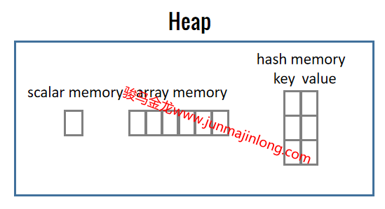

## Perl变量基础

Perl中的变量可以是标量类型、数组类型或hash类型的，标量类型的变量在变量名前使用`$`前缀，数组类型的变量在变量名前使用`@`前缀，hash类型的变量在变量名前使用`%`前缀。

**Perl严格区分标量、数组、hash这三种类型，因为这决定了perl如何划分内存空间来保存数据**：  

- 标量类型意味着只保存单个数据，perl会为这样的变量分配用于保存**单个数据的内存空间**  
- 数组类型意味着可保存多个数据，perl会为这样的变量分配用于保存**多个数据的连续内存空间**  
- hash类型意味着可保存多个key-value键值对数据，perl会为这样的变量分配用于保存**多个键值对数据的内存空间**  

参考下面的简图：



由于数组和hash要留在后面的章节中介绍，加之变量的使用也比较灵活，因此这里仅介绍一些标量类型的变量的基础用法。

### 变量声明和变量赋值

声明全局变量并为变量赋值：

```perl
$name = "junmajinlong";
print $name, "\n";
```

使用变量时，可以使用`$name`的方式，也可以使用更安全更标准的`${name}`方式。有时候必须使用`${name}`这个形式来使用变量name，否则会产生歧义。

例如，假如声明并赋值了变量name，如果在双引号字符串中使用变量内插，那么`"$namehello"`很可能是错误的写法(但不一定会报错)，因为这会寻找名为namehello的变量而不是名为name的变量，因此，写成`"${name}hello"`可能才是正确的。

Perl也允许直接使用未声明、未赋值的变量，此时将根据上下文来决定该变量(这里暂且只考虑标量变量)的值是undef还是空字符串还是数值0。

```perl
use 5.010;

say "name: $name";  # 未声明变量在字符串上下文中当作空字符串使用
say "age: ", $age + 20; # 未声明变量在数值上下文中当作数值0使用
```

但是注意，**在strict模式下，不允许声明全局变量，也不允许使用未声明的变量**。

在strict模式下，需要使用my来声明变量，此时可以先声明，后赋值。已声明但未手动赋值的变量，默认被初始化赋值为undef值。

```perl
use strict;

my $age;    # 先声明，默认被初始化赋值为undef
$age = 23;  # 再赋值
my $name = "junmajinlong";  # 声明并赋值
print "$name, $age\n";
```

Perl中的变量可以重复声明，后声明的变量将掩盖(mask)已声明的变量。如果开启了warning，将给出变量掩盖的警告信息。

```perl
my $name = "junmajinlong";
my $name = "gaoxiaofang";
```

实际上，变量保存的是指向内存中数据的引用(指针)，重新声明或重新赋值变量只是改变了变量中保存的指针所指向的内存位置。上例中，name标量中保存的是指向堆内存中字符串`junmajinlong`的指针，随后重新声明并赋值，表示让name保存指向堆内存中字符串`gaoxiaofang`的指针。但是，之前的变量name和它指向的数据`junmajinlong`并没有消失，它只是被掩盖了而无法再被使用，这意味着这部分内存数据将无法被回收。

**Perl中的变量只区分是标量、数组还是hash，这决定了perl如何为它们划分内存空间。但是，它们所保存的实际数据不区分数据类型**。比如，标量可以保存字符串，也可以保存数值。

```perl
my $name = "junmajinlong";  # name标量中保存字符串类型的数据
$name = 233;    # name标量中保存数值类型的数据
$name = 2.3;    # name标量中保存浮点数类型的数据
```

Perl中的变量赋值自身也有返回值，它的返回值是**变量自身(或者说是左值lvalue)**。多数时候，也可以将变量赋值看作是返回变量所保存的值。

```perl
# 先执行my $y = "hello"，它返回$y
# 再执行赋值操作$x = $y
# 使得$x和$y都保存了"hello"
my $x = my $y = "hello";
```

因为变量赋值返回变量自身，因此，可以直接在赋值语句上执行那些会原地修改的操作，这会直接修改变量：

```perl
use v5.12;

my $y = "hello";
# 先执行赋值，使得$x也保存字符串数据"hello"
# 然后返回变量自身$x作为左值，参与s///替换
# 因此替换后，$x已被修改
( my $x = $y ) =~ s/.*/12345/;
say $x;     // 12345
say $y;     // hello
```

Perl中可以一次性为多个变量赋值。

```perl
# 下面两条语句等价，但显然第一条语句更简洁
my ($x, $y, $z) = (11, 22, 33);
my $x = 11, my $y = 22, my $z = 33;
```

对于Perl来说，这两条等价的赋值语句很有研究意义，但是在这里却无法展开介绍。因此，留待后续章节再述。

Perl中执行赋值语句时，总是先计算赋值操作符(即等号`=`)右边的表达式，然后将表达式的结果赋值给左边的变量(严格来说是左值`lvalue`)。

```perl
# 先计算第一个`=`右边的表达式，即`my $y = 22`，
# 发现该表达式还是一个赋值表达式，于是再计算
# 第二个`=`右边的表达式，即数值22，于是将22赋值
# 给$y，而$y = 22返回$y自身，于是将$y的值赋值给$x
my $x = my $y = 22;
```

将一次性为多个变量赋值的特性和先计算赋值操作符右边表达式的特性结合起来，使得交换变量变得非常轻松：

```perl
my $x = 22;
my $y = 33;
($x, $y) = ($y, $x);  # 赋值之后，$x=33，$y=22
```

甚至，允许保存外部作用域中的同名变量的值：

```perl
my $x = 22;
{
  # 将大括号外面的$x的值赋值给当前作用域内的$x
  my $x = $x;
  $x = $x + 1; # 修改当前作用域内的$x
  say $x;     # 23
}
say $x; # 22
```

### 关于my和局部变量

不使用my声明的变量是全局变量，my声明的变量是局部变量，它有自己生效的作用域范围。关于作用域规则，在后面会详细介绍。这里只需要知道，大括号是一个独立的作用域。

```perl
my $out = 11;
$global_out = 111;    # 全局变量
{
  my $in = 22;
  $global_in = 222;    # 全局变量
}
print $global_in;  # 222
```

除了使用my声明变量，还可以使用our、local、state声明变量，它们都有自己的变量作用域规则，但目前无需深究它们的用法。

那么是直接声明全局变量还是使用my声明局部变量？几乎任何一种语言，任何一个有编程经验的人，都建议尽量使用局部变量，且少用全局变量。

但是，在Perl里面可以忽略这样的建议，至少需要看情况来决定是否使用局部变量：  

- 写行数较多的Perl脚本时(功能相对复杂)，尽量使用my声明局部变量  
- 写涉及多个Perl文件(即使用了package时)的Perl程序时，尽量使用my声明局部变量，甚至要合理使用out、local  
- 写较小的Perl脚本、写一个简单的Perl命令工具时，请随意，因为这时即使使用全局变量出问题也很容易调试  
- 写Perl一行式命令时，全部使用全局变量，尽可能地缩减命令行的字符数量，如非必须，否则不要使用my声明局部变量，因为没有必要  

### undef和defined()

在Perl中，如果一个变量未声明，那么这个变量会被当作undef来使用，如果声明了变量，但未手动赋值，那么这个变量会被初始化赋值为undef。也可以将undef赋值给某个变量，使得这个变量回到未赋值状态。

```perl
say $name;   # 使用未声明变量
my $age;     # 声明变量但未手动赋值
my $gender = undef;  # 手动赋值为undef
```

在strict模式下，不允许使用未声明变量，但可以使用undef值，而在warnings模式下，某些地方使用未声明值(undef)将给出警告。

实际上，**undef是一个函数**，但几乎总是可以将它当作一种表示未定义的值来看待。

undef作为值，表示的含义是此处缺失或没有，例如`$age=undef`(这里调用了undef函数)表示age变量缺失数据、没有数据。

undef作为函数，如果不给任何参数，将直接返回未定义值，如果undef一个变量(如`undef $name`)，则取消变量的声明。

undef可以当作数值0或空字符串使用，它自身也代表布尔假。例如：

```perl
my $age;
say $age + 1;    # 1
say "age: $age"; # age: 空字符串
```

很多场景下需要判断一个值是否是undef，Perl提供了defined()函数，当测试的值为undef时，返回undef，否则返回1(Perl中使用1代表布尔真值)。

```perl
my $name = "junmajinlong";
say defined($name);   # 1

if(defined($age)){
  say "defined";
} else {
  say "undefined";
}
```

