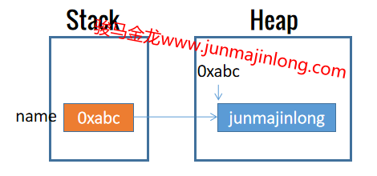
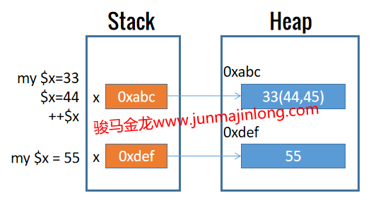
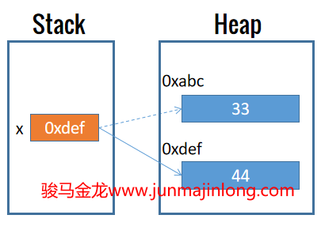
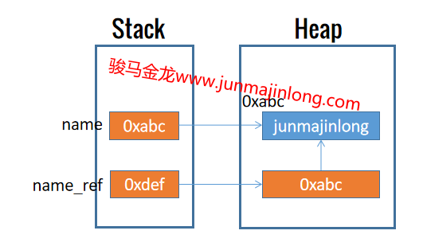

## 深入理解Perl的变量

建议先看[理解变量、数据类型、引用和内存https://junmajinlong.com/coding/variable_datatype_reference_memory/](https://junmajinlong.com/coding/variable_datatype_reference_memory/)，了解一些有关于变量本质的内容之后，再看本文Perl中变量的行为，收获将更大。

----------

### Perl变量是一个引用

对于下面的变量赋值代码，这表示将内存中的字符串数据`"junmajinlong"`保存到变量name中去。

```perl
my $name = "junmajinlong";
```

注意，**这里的变量名是name，而不是`$name`，前缀`$`符号具有特殊意义**。不仅如此，数组变量的前缀`@`、hash变量的前缀`%`也一样如此。这些前缀的意义将在后文详细解释。

```perl
# 下面两个变量的变量名分别为names和person，而不是@names、%person
my @names = ("junmajinlong", "gaoxiaofang", "fairy");
my %person = (name => "junmajinlong", age => 23, );
```

**Perl变量完全使用引用的方式去存储数据**。这意味着，对于上面的name变量，它保存的是指向字符串数据`"junmajinlong"`的引用，而不是直接保存该字符串，或者干脆说变量name就是一个指向字符串数据的引用。

严格来说，perl会在堆内存中存放好字符串数据`"junmajinlong"`，然后将该内存空间的地址保存在栈中某个位置，变量name就是这个栈中数据。

如下图所示：



### Perl允许原地修改内存数据

**Perl允许原地修改内存数据**。这意味着修改变量的数据或为变量重新赋值时，修改后的数据或新数据直接保存在原内存中，变量保存在栈中的引用地址不会发生改变，也即它所指向的内存仍然是原来的内存。

但注意，重新声明同名变量时，会创建新的变量并掩盖(mask)原有的同名变量，它们的内存地址是不一样的。

如图：



在Perl中，**可以在某个变量前加上反斜线来获取该变量所保存实际数据的内存地址**，例如`\$name`将获取变量name所保存堆内存数据的地址。

```perl
my $name = "junmajinlong";
print \$name;     #  输出：SCALAR(0x685bf8)
```

因此，只要`\$x`和`\$y`获取到的地址是相同的，那么就可以说明变量x和变量y指向了同一个内存位置，反之，如果地址不同，则说明它们是不同变量。

因此，也可以用代码验证Perl是否真的是在原地修改内存数据的。

```perl
use v5.12;

my $x = 33;
say "x: $x, ", "addr: ", \$x;

# 为变量重新赋值，变量指向的内存地址不变
$x = 44;
say "x: $x, ", "addr: ", \$x;

# 修改变量数据，变量指向的内存地址不变
++$x;
say "x: $x, ", "addr: ", \$x;

# 但重新声明同名变量，原有变量将被掩盖，新变量指向新内存地址
my $x = 55;
say "x: $x, ", "addr: ", \$x;
```

输出结果：

```
x: 33, addr: SCALAR(0x6a05c0)
x: 44, addr: SCALAR(0x6a05c0)
x: 45, addr: SCALAR(0x6a05c0)
x: 55, addr: SCALAR(0x6a0bd8)
```

注意，其他有些语言，不允许原地修改数据，这意味着修改变量数据时，会申请一个新的内存空间来存放修改后的数据，然后让变量指向新的内存空间。这种方式会让变量所保存的地址发生改变。如图：



### 理解Perl的变量前缀：Sigil

熟悉Shell的人，肯定知道变量赋值和使用变量的方式。例如，对于bash来说：

```bash
# 变量赋值
blog_url="www.junmajinlong.com"
# 访问变量：变量替换，将变量的值替换到命令行上
echo $blog_url       # 输出www.junmajinlong.com
# 修改变量(变量扩展)并访问修改后的值
echo ${blog_url#*.}  # 输出junmajinlong.com
```

对于bash来说，上面的变量名为`blog_url`，在变量前加上`$`符号，表示访问该变量的值。

Perl和Shell非常相似，理解了上面Shell的变量使用方式，也就理解了Perl的变量使用方式。

下面的Perl代码声明了name变量并为其赋值，然后在print中使用了该变量：  

```perl
my $name = "junmajinlong";
print "$name\n";
```

需要注意的是，尽管声明变量的时候加上了`$`前缀，但变量名为name，而不是`$name`。`$`前缀表示去访问变量对应的内存地址。

Perl在做变量赋值时、在使用变量时，都会在变量前加上变量前缀。对于标量标量，它的前缀是`$`符号，对于数组变量，它的前缀是`@`符号，对于hash变量，它的前缀是`%`。这些特殊的前缀，在Perl中称为Sigil。

Sigil前缀隐含了多种含义，其中之二是：  

- (1).**根据变量所保存的内存地址去访问该地址所指向的内存空间**  
- (2).**根据Sigil类型决定如何划分以及如何访问内存空间**：  
  - `$`前缀表示标量，只划分或只访问一个内存数据空间(chunk)  
  - `@`前缀表示数组，划分或访问多个内存数据空间  
  - `%`前缀表示hash，划分或访问多个用于存放key-value的内存数据空间  

下面将详细介绍Sigil的这两种含义，更多的含义要在以后遇到了再做解释。

对于含义(1)：**根据变量所保存的内存地址去访问该地址所指向的内存空间**。

也就是说，Sigil前缀的作用类似于导航的功能，根据变量名导航到该变量对应的内存空间处。至于导航到那里之后，是读取内存数据还是向该内存写入数据，由上下文决定。

例如，`print "$name";`语句中使用了`$name`，perl将根据变量name在栈中所保存的地址找到对应的内存空间。由于该语句中的`"$name"`是print参数的一部分，因此perl会将该内存地址处的数据`"junmajinlong"`读取出来并进行变量内插。

**当带有Sigil前缀的变量放在赋值操作符`=`的左边时，表示将数据保存到该变量所指向的内存中**。例如`$name = "junmajinlong"`，perl解析该语句时，发现`$name`出现在左边，perl就知道这是为变量name赋值，perl会找到name变量并将字符串数据放进变量name所指向的内存空间处。如果找不到name变量，则声明name变量并为其初始化赋值为undef。

也就是说，**变量初始化之后就在它的栈中保存了一个指向堆内存中某块空间的地址，由于Perl允许原地修改内存，因此栈中的这个地址在perl程序运行期间将永不改变**。

```perl
use v5.12;

my $x;
say "addr x: ", \$x;

$x = "hello";
say "addr x: ", \$x;

$x = 33;
say "addr x: ", \$x;
# 输出结果：
#   addr x: SCALAR(0x26169b8)
#   addr x: SCALAR(0x26169b8)
#   addr x: SCALAR(0x26169b8)
```

此处需要注意，虽然重新声明同名变量会掩盖已有变量使之不可用，但原有变量并未失效，它仍然指向某个堆内存地址，并将持续到程序退出。

对于含义(2)：**根据Sigil类型决定如何划分以及如何访问内存空间**。

例如，当perl发现赋值操作符左边的是`$name`，由于前缀`$`表示标量，perl就知道要为变量name划分一个内存数据空间用来保存单个标量数据。因此，**\$前缀的意思是：要访问或要保存单份数据，而不是多份数据**。

当perl发现赋值操作符左边的是`@names`，由于前缀`@`表示数组，perl就知道要为变量names划分多个内存数据空间，至于具体要划分多少个内存数据空间，perl将自己决定。**@前缀的意思是：要访问或者要保存多份数据，而不是单独的一份标量数据**。

**%前缀的意思是：要访问或者要保存多份key/value键值对数据，而不是单独的一份标量数据，也不是多份没有键值对映射关系的数据**。

如果理解了以上结论，那么就很容易理解下面这两个Perl中令人感觉别扭的用法：

- 访问数组、hash的某个元素时，使用`$`前缀，而不是@或%前缀，这是因为访问单个元素时，是要访问单个内存数据空间  
- 要进行切片时，使用的是@前缀，因为访问多个元素时，是要访问多个内存数据空间  

```perl
my @arr = (11, 22, 33);
my %person = (name => "junmajinlong", age => 23,);
# 访问数组单个元素
say $arr[1];
# 访问hash单个元素的值
say $person{name};

# 数组切片，保存到数组slice_arr中
my @slice_arr = @arr[0, 2];
say "@slice_arr";

# hash切片，保存到数组slice_hash中
my @slice_hash = @person{"name", "age"};
say "@slice_hash";
```

关于数组、hash和切片，后面的文章将会详细介绍。

### 理解标量的内部类型

Perl区分三种类型的变量：标量、数组和hash。对于标量来说，它表示单个数据，站在内存的角度来看，它意味着单个内存数据空间(chunk)。

实际上，**Perl的标量类型有三种基本类型：数值(整数、浮点数)、字符串、引用**。虽然它们都是标量，都存放在单个内存chunk中，但perl内部会区分它们的类型，不同的标量类型，存储到内存chunk中的方式不一样，同样的，读取它们的方式也不一样。

例如，引用是一串代表内存地址的数值，假如以十六进制来表示。那么，对于十六进制数值`0x123abc`，显然它是标量类型，它可以看作一个内存地址，也可以看作一个十六进制数值，但perl如何知道这个是普通数值还是内存地址呢？其实，perl在存储这个标量数据的时候，就会根据其所属类型，以不同方式去存储。

### 初步理解Perl的引用

由于可以通过`$`前缀加变量名取得变量所指向的堆内存数据，而变量本身是一个引用，因此，可以换一个角度来思考，只要获取到一个堆数据的引用并将其保存到变量中，就可以在这个变量前面加上`$`前缀来取得它所指向的堆内存数据。

在Perl中，获取变量的引用的方式是在字面量数据前或变量前加上反斜线(如`\42 \$x`)。例如`\$name`得到变量name所保存堆数据的引用。

```perl
# 变量name是一个引用，指向堆数据"junmajinlong"
# 即：(name)0xabc -> "junmajinlong"
my $name = "junmajinlong";

# 获取堆数据的引用，即它的地址，将地址保存到另一个变量中
my $name_ref = \$name;
```

现在变量name_ref保存的实际数据是指向`"junmajinlong"`的地址。

注意，变量name_ref本身是一个标量变量，而每个变量都是一个引用，它在栈中保存一个指向实际数据的地址。因此，既然name_ref保存的实际数据是指向`"junmajinlong"`的地址，那么name_ref变量在栈中保存的是一个指向该地址的地址。即：  
```perl
(name_ref)0xdef -> 0xabc
0xabc -> "junmajinlong"
```

看图更容易理解：



因此，`$name_ref`等价于变量`name`，它们都是指向堆中字符串数据的地址。

既然可以使用`$name`获取堆中字符串数据，当然也可以使用`$$name_ref`获取这份堆中字符串数据。或者换个写法会更清晰：`${name}`和`${$name_ref}`是等价的，因为`name`和`$name_ref`是等价的。

```perl
my $name = "junmajinlong";
my $name_ref = \$name;

print "$name\n";        # ${name}
print "$$name_ref\n";   # ${$name_ref}
```

输出：

```
junmajinlong
junmajinlong
```

### Perl按值拷贝还是按引用拷贝？

先给结论：  

1. b变量赋值给a变量时，按值拷贝  
2. 函数(或子程序)调用时，参数传递的规则要复杂一些，这部分传值规则要留在子程序章节再详述

对于变量赋值时按值拷贝其实很容易理解。对于如下赋值代码：

```perl
my $b = "junmajinlong";
my $a = $b;
```

将`$b`赋值给`$a`时，根据Sigil的规则，出现在赋值操作符左边的`$a`表示写内存，出现在赋值操作符右边的`$b`表示读内存数据。也就是说，读取`$b`保存在堆内存中的数据，并将其写入`$a`对应的内存空间。因此，内存中将存在两份值相同但地址不同的数据。

可查看它们的地址：

```perl
use v5.12;
my $b = "junmajinlong";
my $a = $b;
say \$a;
say \$b;
```

输出：

```
SCALAR(0x2550130)
SCALAR(0x25503d0)
```

### 理解Perl的赋值：左值lvalue

当Sigil出现在赋值操作符左边时，表示对变量进行赋值。例如：

```perl
my $name = "junmajinlong";
```

这个赋值过程实际上是找到name变量的内存地址，然后将字符串数据写入该内存。

但是，Perl并不仅仅只允许为变量赋值，还可以为数组的元素赋值，为hash的元素赋值，甚至还可以为某些函数调用后的返回结果进行赋值。

```perl
# 变量赋值
my $name = "junmajinlong";

# 为数组元素赋值
my @arr;
$arr[0] = "junmajinlong";

# 为hash元素赋值
my %person;
$person{name} = "junmajinlong";

# 对某些函数调用的返回结果赋值
my $name = 'jun';
substr($name, 3) = 'ma';
```

实际上，**所有可以进行赋值的目标都出现在赋值操作符的左边，它们有一个更为通用的称呼：左值(lvalue)**。

与左值对应的概念是右值。左值和右值并非是Perl独有的概念，而是编程领域中的通用概念：**左值用来向内存中保存数据，右值用来从内存读取数据(即从内存返回数据)**。

当我们说某个东西是左值或表现为左值的时候，就代表可以通过它写入数据从而将数据保存到内存中。

例如，Perl中的变量是一种左值，Perl的substr函数也可以表现为左值，Perl中赋值操作的返回值也可以作为左值。

```perl
(my $name = "junmajinlong") =~ s/j/J/;
say "$name";   # 输出：Junmajinlong
```

