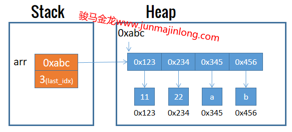

## 数组的基本使用

数组是包含一系列标量数据的容器，或者说数组由零个、一个或多个标量数据组成，数组在内存中的体现，则是由多个内存数据空间组合在一起。

创建数组时，perl可能要为它划分多个内存chunk，因此数组变量要求使用`@`前缀。

例如，可通过下面这种方式创建数组，这表示创建一个名为arr的数组变量，它保存了4个数值标量数据。

```perl
my @arr = (11, 22, 33, 44);  # 只包含数值的数组
```

Perl数组是动态的，不限制数组的长度(元素个数)，可以在任何时候往数组中增加任意多的元素。例如可以使用push函数向数组中追加元素。

```perl
my @arr = ();   # 声明空数组
push @arr, 11;
push @arr, 22;
say "@arr";  # 别忘了，双引号允许内插数组
# 输出：11 22
```

Perl数组也不限制所存放元素的数据类型。例如：

```perl
# 数组中同时保存数值、字符串
my @arr = (11,22,'a','b');
```

实际上，**数组中保存的是这些元素的引用，而引用地址是一种标量**。例如，上例数组的内存布局大致如下图所示：



### qw创建数组

当创建只包含字符串元素的数组时，每个元素都要使用单引号或双引号引用起来，这在书写上比较麻烦。

Perl提供了类似于q和qq的qw字面量表示法，qw的全称是quote words，即自动引用单词。perl会在编译期间将qw所引用的单词自动替换为单引号。

例如，下面的两行赋值语句是等价的。

```perl
my @arr1 = ('a', 'b', 'c', 'd');
my @arr2 = qw(a b c d);
```

注意，qw中使用空格分隔各元素，如果某个元素包含空格，则无法使用qw字面量语法。

另外，上面示例使用的是`qw()`，其中括号可以替换为其他成对的符号，这一点和q或qq的用法完全一致。

```perl
qw()
qw[]
qw!!
qw%%
```

### 索引数组

**可通过数值下标来索引数组的元素，下标从0开始。注意，索引数组元素时使用前缀`$`加数组标量名加索引下标值，使用`$`前缀的原因是要访问数组中这个元素的单个内存chunk**。例如：

```perl
my @arr = (11,22,33,44);
# 读取index=0位置处也就是第一个元素
say $arr[0];
```

**Perl还支持负数索引，表示从数组尾部开始计算元素的位置**。index=-1表示倒数第一个也就是最后一个元素的位置，index=-2表示倒数第二个元素的位置。

```perl
my @arr = (11,22,33,44);
say $arr[-1];     # 44
say $arr[-2];     # 33
```

**对数组进行索引时，它也可以作为左值被赋值，这表示将所赋值数据写入该元素对应的内存空间**。

```perl
my @arr = (11,22,33,44);
# 作为左值被赋值
$arr[1] = 222;
$arr[-1] = 444;
say "@arr";   # 输出：11 222 33 444
```

**数组越界访问时，perl不会报错，而是返回undef。数组通过正数索引越界赋值时，将使用undef填充中间缺失的元素**。

```perl
my @arr = (11,22,33,44);
say $arr[10];     # 输出空字符串，数组不变

# 数组长度为11，最后一个索引为index=10
# 中间index=4到index=9的元素都被填充为undef
$arr[10] = 9999;
```

### 扩展数组

在Perl中，当需要多个数据的时候，都是将多个数据放进列表。

要扩展数组，Perl中的逻辑是将数组放进小括号中，这会将数组转变成列表格式，然后在列表上扩展更多元素。

例如：

```perl
my @arr = (11,22,33);
@arr = (@arr, 44, 55);  # 扩展数组
say "@arr";  # 11 22 33 44 55
```

换句话说，当数组放进小括号时，数组会被压平后放进小括号。

```perl
my @arr = (11,22,33);
# 数组先展开，得到(11,22,33)，然后赋值给@arr1
my @arr1 = (@arr);
```

### 数组长度

数组长度表示数组当前存储了多少个元素。Perl并未像其他语言一样提供相关函数来获取数组长度，**Perl获取数组长度的方式是将数组放进标量上下文**。

**标量上下文表示被需求的是一个标量数据。如果这个位置放置的本就是标量数据，则直接使用该数据，如果该位置放置的是数组、hash类型的数据，perl内部会自动将它们转换为标量类型**。它们按照如下规则进行转换：

- 数组转换为标量得到的是数组的长度  
- hash转换为标量得到的是`M/N`格式的字符串，N表示hash的容量，M表示hash当前的键值对数量  

除了知道数组、hash转换为标量时的转换规则，更重要的是需要知道何时处于标量上下文，只有在标量上下文，它们才会转换。但Perl有很多种情况会进入标量上下文，Perl并没有一种完整的规则来描述何时处于标量上下文，一切皆凭感觉。但**总是可以使用`scalar`来强制进入标量上下文**。

例如：

```perl
my @arr = (11,22,33,44);
my %p = (
  name => "junmajinlong",
  age => 23,
  gender => "male",
);

# scalar使其参数强制进入标量上下文
say scalar @arr;    # 输出：4
say scalar %p;      # 输出：3/8
```

有时候会使用数组长度作为索引，来向数组尾部追加一个元素：

```perl
my @arr = (11,22,33);
$arr[scalar @arr] = 44;
say "@arr";  # 输出：11 22 33 44
```

### 数组最大索引

数组最大索引，即数组最后一个元素的索引。

知道数组长度后，就知道了最后一个元素的索引：长度减一。
```perl
my @arr = (11, 22, 33, 44);
my $arr_max_idx = scalar @arr - 1;  # 3
```
实际上，Perl为每个数组都保存了最大索引值。甚至，Perl单独为获取数组最大索引提供了一种语法：`$#arr`。其中`#arr`表示获取数组最大索引值，因为索引是一个标量数值，所以加上`$`前缀来访问该标量值。

例如：

```perl
my @arr = (11, 22, 33, 44);
say $#arr;   # 3
```

因此，可以通过`$arr[$#arr]`表示数组最后一个元素数据。通过下面这种方式，可以向数组尾部追加一个元素：

```perl
my @arr = (11,22,33);
$arr[++$#arr] = 44;
say "@arr";  # 输出：11 22 33 44
```

实际上，`$#arr`的值总是长度减一，例如空数组的`$#arr`值为负一。

注意，最大索引值和长度会相互影响，修改最大索引值会同步修改数组长度，这会导致数组的扩展或截断。

例如：

```perl
my @arr = (11,22,33,44);
$#arr = 10; # 将修改长度为11，缺失元素使用undef填充
$#arr = 2;  # 将长度修改为3，截断元素44和后面的空元素
```

### 字符串内插数组

双引号字符串中可以直接内插数组变量，内插时，默认将各元素使用空格分隔然后替换到内插表达式位置处。

例如：
```perl
my @arr = (11, 22, 33);

# 内插后，得到字符串："arr: 11 22 33"
my $str = "arr: @arr";
```

实际上，双引号内插数组时，是使用内置变量`$"`的值作为数组元素分隔符的，该变量默认值为空格：
```perl
say qq(x${"}x);  # 输出： x x
```

因此修改`$"`的值，可以改变数组元素的分隔符。
```perl
my @arr = (11, 22, 33, 44);
$" = "-";
say "@arr";   # 11-22-33-44
```

### print/say输出数组

实际上，print、say是能够直接输出数组的。
```perl
my @arr = (11, 22, 33);
say @arr;  # 输出：112233
```

当未将数组内插进双引号字符串时，print/say默认会将数组各元素紧密相连，正如上面输出的结果是`112233`一样。

实际上，print/say的参数处于列表上下文，当未将数组内插至双引号中时，数组各元素被展开，这些元素和print/say中逗号分隔的其他参数一起组成一个新的列表。例如：
```perl
my @arr = (11, 22, 33);

# 11 22 33 a b共5个元素共同组成一个列表
say @arr,'a','b'; 
```

print/say输出时，默认使用内置变量`$,`来分隔列表各元素，该内置变量默认值为undef，因此默认情况下各元素被输出时紧密相连。
```perl
my @arr = (11, 22, 33);
say @arr,'a','b';  # 112233ab

$, = "_";   # 将其修改为下划线
say @arr,'a','b';  # 11_22_33_a_b
```
