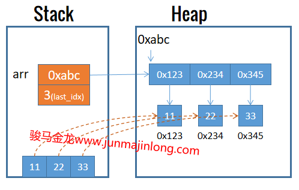

## 理解列表

当使用下面的语法创建数组时：

```perl
my @arr = (11,22,33);
```

实际上，左边的`@arr`表示arr是一个数组变量，右边括号包围的`(11,22,33)`是一个列表，整个代码表示将列表中的所有元素保存到数组arr中。

列表还可以使用`qw`来表示：

```perl
my @arr = qw(11,22,33);
```

也可以直接对列表进行索引取值：

```perl
my $a = (11,22,33)[2]; # $a=33
```

要注意，Perl中的列表不是数据类型，而是Perl在内部用来临时存放数据的一种方式，只能由Perl自行维护。

实际上，**列表临时保存在栈中，当使用了列表数据后，这些列表数据就会出栈**。根据使用列表的不同使用环境，列表数据可能是被复制到了堆内存中保存起来(比如赋值给数组)，也可能是用完直接消失(比如一次性使用的列表)。

### 区分列表和数组

学习Perl的时候，需要区分列表和数组。如果了解过其他编程语言，可以将Perl列表看作是一种特殊的底层可迭代对象，它看起来像数组，但不是数组。

数组是列表最直观的一种体现形式，是暴露给编程人员的一种数据类型。创建数组时，初始化数组元素很可能来自于列表：

```perl
my @arr = (11,22,33);  # 数组arr的元素来自于列表
```

上面的赋值语句，其内部过程大致为：在栈中存储好列表元素，当开始赋值时，perl将栈内列表各元素拷贝到堆内存，并在数组变量arr的各内存中保存这些堆内存数据的引用地址。拷贝完成后，栈中的列表数据全部出栈。



编程人员可以直接操作数组，比如可以将元素push到一个数组，可以pop弹出数组最后一个元素，等等，这些操作无法用于列表。而元素排序、元素筛选、迭代遍历等操作，都可以用于列表。


