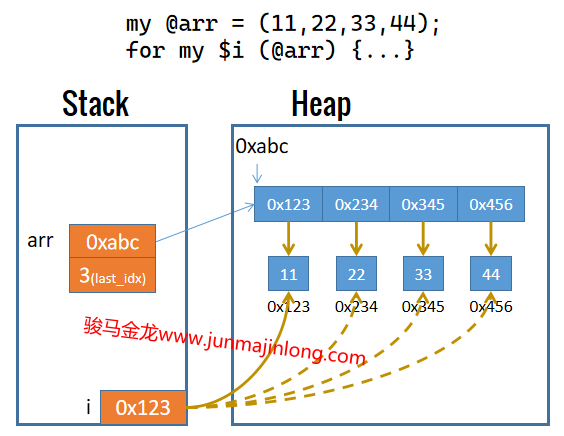

## 遍历列表和数组，默认变量$_

对于数组来说，可以使用while循环或for循环的方式来遍历所有元素：

```perl
my @arr = qw(a b c d e f);

# while
my $i = 0;
while($i <= $#arr){
  say "index: $i, value: $arr[$i]";
  $i++;
}

# for
for(my $i=0;$i<=$#arr;$i++){
  say "index: $i, value: $arr[$i]";
}
```

上面的while和for循环利用的是数组的最大索引`$#arr`，使用数组的长度作为条件也一样。

一般来说，使用迭代的方式来遍历数组或遍历列表会更方便。Perl中可以使用for或foreach进行迭代，foreach是for的语法糖，foreach能做的，for都能做。

for或foreach的迭代数组或列表的方式如下。

```perl
my @arr = qw(a b c d e f);

# for
for my $v (@arr) {
  say "value: $v";
}

# foreach
foreach my $v (@arr) {
  say "value: $v";
}
```

for或foreach迭代时，会从列表中逐个取元素，取一个元素，赋值给迭代控制变量`$v`，然后执行一次循环体，再继续取下一个元素。

注意，**迭代每个列表元素时，元素是按引用传递给控制变量的，控制变量在栈中保存了元素的内存地址，每次迭代时控制变量的地址都发生改变。因此可以推断，每次迭代时，Perl都会重新声明控制变量，每次声明的控制变量仅在本次迭代过程中有效**。

```perl
my @arr = (11, 22, 33, 44);
my $v = 3333;
say \$v;
say '---- before ----';
for my $v (@arr) { say \$v; }
say '---- after ----';
say \$v;
say "$v";
# 输出：
#   SCALAR(0x22f3d10)
#   ---- before ----
#   SCALAR(0x2277ab0)
#   SCALAR(0x2277a98)
#   SCALAR(0x2277b40)
#   SCALAR(0x2277b58)
#   ---- after ----
#   SCALAR(0x22f3d10)
#   3333
```

因此，for或foreach迭代时，赋值过程大致如下图：



因此，如果在循环体内修改控制变量，也将直接修改列表中该元素的值。

```perl
my @arr = (11, 22, 33, 44);
for my $v (@arr) {
  $v++;
}

say "@arr";  # 输出：12 23 34 45
```

在使用for/foreach迭代数组时要注意，修改数组大小会影响迭代。

```perl
my @arr = (11,22,33,44,55,66);
for my $i (@arr){
  shift @arr;
  say $i;  # 11 33 55
}
```

### 默认标量变量$_

for和foreach迭代时需指定控制变量，例如`for $i (...)`。

**控制变量是可以省略的，此时将使用Perl的默认标量变量`$_`**。

下面两条for迭代语句完全等价：

```perl
for(11,22,33){ say $_; }
for $_ (11,22,33) { say $_; }
```

**Perl的很多操作都允许省略操作目标，此时将使用默认变量`$_`作为这些操作的操作目标**。以后在使用Perl的过程中，自然会发现这一点。

例如，chomp函数用来去除字符串变量尾部的换行符，它可以省略操作目标，此时将操作`$_`变量。因此，下面两条语句是等价的。

```perl
chomp;
chomp $_;
```

print/say也可以省略参数，这时表示输出`$_`的值。下面等价：

```perl
print;
print $_;
```

<a name="perl_each"></a>

### 小心使用each

使用while循环或for循环遍历列表时可以获得各元素的索引，但使用for迭代或foreach迭代列表各元素时，无法获取迭代时元素的索引。

Perl提供了一个名为`each`的函数，它可用于迭代数组和hash。在列表上下文，each会返回数组的`(index, value)`或hash的`(key, value)`，在标量上下文，each会返回当前所处的*index*或*key*。

将while结合each一起使用，会非常方便。例如：

```perl
my @arr = (11,22,33,44);

# 列表上下文，each返回(index, value)
while(my ($idx, $v) = each @arr) {
  say "index: $idx, value: $v";
}
```

也可以单独使用for迭代，然后在循环体中使用each获取索引：

```perl
my @arr = (11,22,33,44);
for my $v (@arr){
  # 标量上下文，each返回index
  say "index: ".(each @arr).", value: $v";
}
```

但是，**each是有问题的**：`each @arr`取完最后一个元素后，不会重置迭代指针，下次再执行`each @arr`，在列表上下文将返回空列表，在标量上下文将返回undef，再之后才继续从索引0、1、2开始。

each取完最后一个元素后返回空列表或undef，其好处是可以直接在while循环中表示布尔假，使得取完所有元素后终止while循环。但如果不是each取完最后一个元素触发while循环的终止，那么任何使用each的地方都将出现不符合期待的结果。

例如，下面使用`while+each`两次循环遍历数组arr，并在第一个while中使用last提前退出while循环。

```perl
my @arr = (11,22,33,44);
while(my ($idx, $v) = each @arr) {
  say "index: $idx, value: $v";
  last if $idx == 2;
}
while(my ($idx, $v) = each @arr) {
  say "index: $idx, value: $v";
}
```

输出结果：

```
index: 0, value: 11
index: 1, value: 22
index: 2, value: 33
index: 3, value: 44
```

再比如，下面的两次for迭代，都在循环体中使用each取索引，将出现问题：

```perl
my @arr = (11,22,33,44);
for my $v (@arr){
  say "index: ".(each @arr).", value: $v";
}
for my $v (@arr){
  say "index: ".(each @arr).", value: $v";
}
```

输出结果：

```perl
index: 0, value: 11
index: 1, value: 22
index: 2, value: 33
index: 3, value: 44
index: , value: 11
index: 0, value: 22
index: 1, value: 33
index: 2, value: 44
```

因此，**each唯一安全的使用方式是：while + each，但while循环内不能改变while的循环流程且不能使用keys、values重置迭代指针**。例如，while...each内最好不要使用last、next等。

事实上，Perl官方手册(`perldoc -f each`)建议尽量使用foreach迭代取代while each。