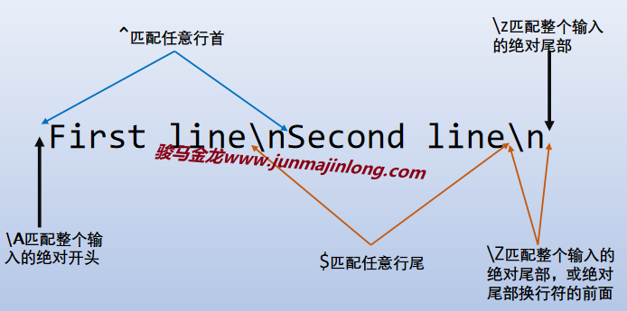

## Perl正则支持的反斜线序列

大致可分为三类反斜线序列：位置锚定反斜线序列、字符匹配反斜线序列、分组捕获相关的反斜线序列。

### 位置锚定反斜线序列

所谓锚定，就是【零宽断言(zero-width assertions)】，是指它匹配的是位置，而非字符。比如锚定行首的意思是匹配第一个字母前的空字符。

下面列出了Perl支持的位置锚定反斜线序列：

- `\b`：匹配单词边界处的空字符  
- `\B`：匹配非单词边界处的空字符  
- `\<`：匹配单词开头处的空字符  
- `\>`：匹配单词结尾处的空字符  
- `\A`：匹配绝对行首，换句话说，就是输入内容的开头  
- `\z`：匹配绝对行尾，换句话说，就是输入内容的绝对尾部  
- `\Z`：匹配绝对行尾或绝对行尾换行符前的位置，换句话说，就是输入内容的尾部  
- `\G`：强制从位移指针处进行匹配  

主要解释下`\A \z \Z`，`\G`留在后面全局匹配时解释，其余的则属于基础正则的内容，不多做解释。

`\A \z \Z`和`^ $`的区别主要体现在多行模式下。在多行模式下：  



例如：

```perl
my $txt = "abcd\nABCD\n";

$txt =~ /^ABC*/;   # 无法匹配
$txt =~ /^ABC*/m;  # 匹配

$txt =~ /\Aabc/;   # 匹配
$txt =~ /\Aabc/m;  # 匹配
$txt =~ /\AABC/m;  # 无法匹配

$txt =~ /cd\n$/m;  # 不匹配
$txt =~ /cd$\n/m;  # 该正则是错的，$\被解析变量，即等价于/cd${\}n/m
$txt =~ //cd$(?:)\n/m; # 匹配
$txt =~ /cd$/m;    # 匹配

$txt =~ /CD\Z\n/m    # 匹配
$txt =~ /CD\Z\n\Z/m; # 匹配
$txt =~ /CD\n\z/m;   # 匹配

my $txt1 = "abcd\nABCD";
$txt1 =~ /CD\Z/m;  # 匹配
$txt1 =~ /CD\z/m;  # 匹配
```

### 字符匹配反斜线序列

以下是一些常用的反斜线字符序列。除了以下这几种，还有一些用的不多的反斜线序列`\v \V \h \H \R \p \c \X`，这些不会在此解释。

- `\w`：匹配单词构成部分，等价于`[_[:alnum:]]`  
- `\W`：匹配非单词构成部分，等价于`[^_[:alnum:]]`  
- `\s`：匹配空白字符，等价于`[[:space:]]`  
- `\S`：匹配非空白字符，等价于`[^[:space:]]`  
- `\d`：匹配数字，等价于`[0-9]`  
- `\D`：匹配非数字，等价于`[^0-9]`  
- `\N`：不匹配换行符，等价于`[^\n]`  

由于元字符`.`默认无法匹配换行符，但可以使用特殊组合`[\d\D]`或者`(\n|\N)`来替换`.`，它们能匹配换行符。换句话说，如果想匹配任意长度的任意字符，可以将`.*`换成`[\d\D]*`或`(\n|\N)*`。之所以不用`[\n\N]`，是因为`\N`有特殊意义，不能随意接符号和字母。

### 分组捕获的反斜线序列

- `\1`：反向引用，其中1可以替换为任意一个正整数，即使超出9，例如`\111`表示匹配第111个分组  
- `\g1`或`\g{1}`：也是反向引用，只不过这种写法可以避免歧义，例如`\g{1}11`表示匹配第一个分组内容后两个数字1  
- `\g{-1}`：还可以使用负数，表示距离`\g`左边的分组号，也就是相对距离。例如`(abc)([a-z])\g{-1}`中的`\g`引用的是`[a-z]`，如果-1换成-2，则引用的`abc`  
- `\g{name}`：引用已命名的分组(命名捕获)，其中name为分组的名称  
- `\k<name>`：同上，引用已命名的分组(命名捕获)，其中name为分组的名称  
- `\K`：丢弃`\K`左边的内容。换句话说，要求匹配`\K`左边的内容成功，但却不包含在匹配结果中  

此处暂时还没介绍到命名分组，所以`\g{name}`和`\k<name>`留在后面再介绍。

`\K`表示强制丢弃前面已完成的匹配。例如

```perl
"abc22ABC" =~ /abc\K2.*/;
```

abc三个字母先被匹配，如果没有`\K`，这3个字母将放进`$&`中，但是`\K`使得匹配完abc后立即丢弃前面的匹配，所以这个正则表达式的匹配结果是22ABC。

再例如：

```perl
"abc123abcfoo"=~ /(abc)123\K\g1foo/;
```

它匹配到123后被切断，但是分组引用还可以继续引用，所以匹配的结果是`abcfoo`。

所以，使用`\K`可以做左侧条件判断(类似于逆向环视锚定)：要求成功匹配`\K`左边的部分，但不要它们。
