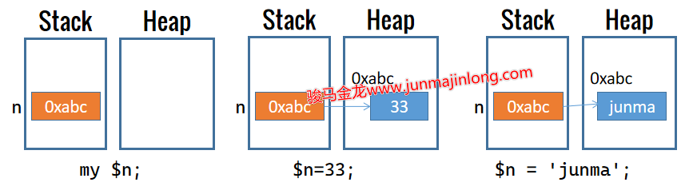
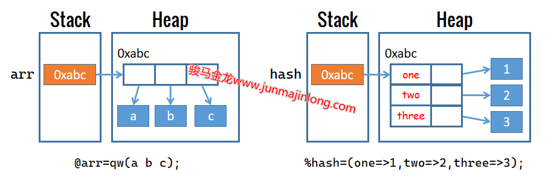
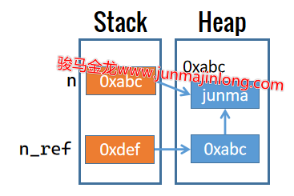
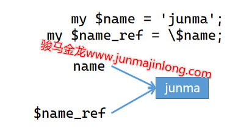

## 引用基础

在前面章节中，曾多次用到过变量的引用：**在变量的sigil符号前加上反斜线即表示该变量的引用**。

例如，通过引用查看变量所保存数据的内存地址：

```perl
my $name = "junmajinlong";
say \$name;    # SCALAR(0x55f80476d588)
```

本书前面章节曾经使用过的引用包括以下几种。除了这几种类型的引用，还有其他类型的引用，比如子程序的引用，文件句柄的引用等，这些类型的引用将在需要的时候再介绍。

```perl
$name    ->   \$name   # 标量变量的引用
@array   ->   \@array  # 数组变量的引用
%hash    ->   \%hash   # hash变量的引用
"abc"    ->   \"abc"   # 字面数据值的引用
```

无论是何种类型的引用，它们都是一种指针，指针中保存了其指向数据的内存地址。打印输出引用时，不同类型的引用，输出结果有所不同：

```perl
my $name = "junma";
my @arr = qw(a b c);
my %h = ( name => "junma", age  => 23 );

say \$name;  # SCALAR(0x55ad7f974dc8)
say \@arr;   # ARRAY(0x55ad7f974738)
say \%h;     # HASH(0x55ad7fa99150)
```

引用是一种指针，因此引用是一种标量数据。

例如：

```perl
my $name = "junma";
my $name_ref = \$name;
```

上面示例中，`name_ref`是一个标量变量，它保存变量name的引用，或者说，`name_ref`保存了变量name所指向字符串数据`"junma"`的内存地址。

再例如，数组的引用、hash的引用，也都是标量数据：

```perl
my @arr = qw(a b c);
my $arr_ref = \@arr;

my %hash = (name=>"junma",  age=>23,);
my $h_ref = \%hash;
```

### 理解变量和引用

当声明变量时，Perl会为该变量初始化(默认初始化为undef)，它在栈中保存了一个内存地址，以后向该变量赋值时，数据都将存放在栈中这个地址所指向的内存处。

> 这一点和某些语言的行为有所不同。
>
> Perl以变量存放的地址为基准，将任何赋值给该变量的数据都放在这个内存地址处，变量指向的内存地址永不改变。
>
> 而有些语言以内存数据为基准，每次为该变量赋值，都修改变量所存放的地址，使得变量指向该数据。

以下面简单的代码为例：

```perl
my $n;
$n = 33;
$n = 'junma';
```

Perl声明变量n并为变量n赋值的过程大致如下图：



Perl中的数组、hash结构，它们保存的元素也都是各数据的引用，而不是直接将数据保存在数组或hash容器中。

例如：

```perl
my @arr = qw(a b c);
my %hash = (one=>1, two=>2, three=>3,);
```

它们的内存布局大致如图：



变量保存在栈中指向内存数据的地址，以及数组或hash中各元素所保存的内存数据的地址，都是Perl内部的引用，Perl会自动解析这些地址从而找到它们所指向的内存位置。

此外，也可以手动创建内存数据的引用。例如创建变量n的引用n_ref：

```perl
my $n = 'junma';
my $n_ref = \$n;
```

n_ref是一个变量，声明这个变量的时候，Perl就为其初始化并在栈中保存了一个内存地址。此外，变量n_ref是一个引用，它是一个标量变量，该变量实际保存的数据是变量n所指向内存数据的地址。

因此，现在内存的布局大致如下图：



从图中可以知道，变量`n`在栈中保存的数据和变量`n_ref`在堆中所保存数据是一致的，都是指向堆中实际数据的指针。

因此，名称`n`和名称`$n_ref`在使用时是等价的，原来使用名称n的地方，都可以替换为使用其引用`$n_ref`。注意，n没有sigil前缀，这表示该变量的栈中数据，即指向`"junma"`的指针，而n_ref有sigil前缀，这表示导航到该变量在堆中保存的数据，即指向`"junma"`的指针。

例如：

```perl
my $name = "junma";
my $name_ref = \$name;
say $name;
say $$name_ref;  # $name中的名称name替换为$name_ref
```



对数组变量名、hash变量名的使用，也一样可以替换为它们的引用：

```perl
# 数组变量名和数组引用：名称arr可被替换为$arr_ref
my @arr = qw(a b c);
my $arr_ref = \@arr;

say $arr[0];        # 或${arr}[0]
say $$arr_ref[0];   # 或${$arr}[0]

# hash变量名和hash引用：名称hash可被替换为$h_ref
my %hash = (
  name => "junma",
  age => 23,
);
my $h_ref = \%hash;

say $hash{name};      # 或${hash}{name};
say $$h_ref{name};    # 或${$h_ref}{name}
```

实际上，只要理解了sigil符号的作用，也能很容易理解变量名和引用变量之间的关系。例如`$name`表示根据name变量所存储的内存地址进行导航，导航到该地址所指向的内存处。对于`${$name_ref}`，内部的`$name_ref`表示根据name_ref所保存的内存地址导航到其所指向的内存处，该内存处保存了一个引用指针，因此，可以继续使用`$`符号根据这个引用指针去导航到最终其所指向的内存处。

### 按引用赋值

Perl手动进行变量赋值时，总是按值拷贝变量数据。

例如：

```perl
my $name = "junma";
my $name1 = $name;
```

上面的name和name1的值都将是`junma`，但它们没有任何关系，它们互不影响。在将`$name`赋值给`$name1`时，`$name`会导航到name所指向的内存地址处，并取得该内存处的数据，拷贝一份保存到name1变量所指向的内存位置处。

但Perl支持操作数据的引用，因此，可以将数据的引用赋值给一个变量。此时仍然算是按值拷贝，只不过拷贝的值是一个引用值。

```perl
my $name = "junma";
my $name1 = \$name;
```

上面的`$name1`和变量name都指向同一个内存地址，`\$name`操作会拷贝一份name所保存的内存地址，然后赋值给变量name1。现在，修改name变量将会影响name1变量：

```perl
my $name = "junma";
my $name1 = \$name;
$name = "junmajinlong";
say $$name1;   # junmajinlong
```

但注意，修改变量name1不会影响变量name，比如为name1重新赋值，这是因为修改name1时，改变的是其所保存的堆数据，这可能会让它不再指向name所指向的数据：

```perl
my $name = "junma";
my $name1 = \$name;

# name1不再是引用变量，而是字符串变量
$name1 = "junmajinlong";  
say $name1;   # junmajinlong
say $name;    # junma
```

可以为某个数据创建任意多个引用：

```perl
my $name = "junma";
my $name_ref1 = \$name;
my $name_ref2 = \$name;
my $name_ref3 = $name_ref2;
```

有时候为了方便，会直接将字面量数据的引用赋值给变量，有时候也会在声明变量的时候直接将其引用赋值给另一个变量：

```perl
# 将字面量的引用赋值给变量
my $name = \"junmajinlong";  
say $name;

# 声明变量的同时，将其引用赋值给变量
my $age_ref = \my $age;
say $age_ref;

# 声明变量的同时赋值，且将其引用赋值给变量
my $age1_ref = \(my $age1 = 33);
say $$age1_ref;    # 33
```

