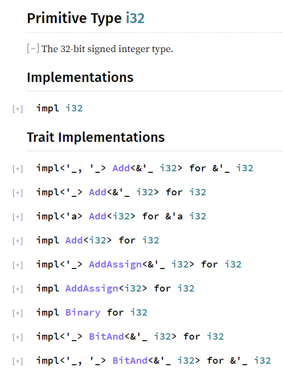

## 再多理解一点Trait

从前面示例来看，某类型实现某Trait时，需要定义该Trait中指定的所有方法，定义之后，该类型也会拥有这些方法，似乎看上去和直接为各类型定义这些方法没什么区别。

但是Trait是对多种类型之间的共性进行的抽象，它只规定实现它的类型要定义哪些方法以及这些方法的签名，至于方法体的逻辑则不关心。

也可以换个角度来看待Trait。**Trait描述了一种通用功能，这种通用功能要求具有某些行为，这种通用功能可以被很多种类型实现，每个实现了这种通用功能的类型，都可以被称之为是【具有该功能的类型】**。

例如，Clone Trait是一种通用功能，描述可克隆的行为，i32类型、i64类型、Vec类型都实现了Clone Trait，那么就可以说i32类型、i64类型、Vec类型具有Clone的功能，可以调用`clone()`方法。

甚至，数值类型(包括i32、u32、f32等等)的加减乘除功能，也都是通过实现各种对应的Trait而来的。比如，为了支持加法操作`+`，这些数值类型都实现了`std::ops::Add`这个Trait。可以这样理解，`std::ops::Add` Trait是一种通用功能，只要某个类型(包括自定义类型)实现了`std::ops::Add`这个Trait，这个类型的实例对象就可以使用加法操作。同理，对减法、除法、乘法、取模等等操作，也都如此。

一个类型可以实现很多种Trait，使得这个类型具有很多种功能，可以调用这些Trait的方法。比如，原始数据类型、Vec类型、HashMap类型等等已经定义好可直接使用的类型，都已经实现好了各种各样的Trait(具体实现了哪些Trait需查各自的文档)，可以调用这些Trait中的方法。

例如，查看i32类型的官方文档，会发现i32类型实现了非常非常多的Trait，下面截图是i32类型所实现的一部分Trait。



i32类型的绝大多数功能都来自于其实现的各种Trait，用术语来说，那就是**i32类型的大多数功能是组合(composite)其他各种Trait而来的**(组合优于继承的组合)。

因此，**Rust是一门支持组合的语言：通过实现Trait而具备相应的功能，是组合而非继承**。

### derive Traits

对于Struct类型、Enum类型，需要自己手动去实现各Trait。

但对于一些常见的Trait，可在Struct类型或Enum类型前使用`#[derive()]`简单方便地实现这些Trait，Rust会自动为Struct类型和Enum类型定义好这些Trait所要求实现的方法。

例如，为下面的Struct类型、Enum类型实现Copy Trait、Clone Trait。

```rust
#[derive(Copy, Clone)]
struct Person {
  name: String,
  age: u8,
}

#[derive(Copy, Clone)]
enum Direction {
  Up,
  Down,
  Left,
  Right,
}
```

现在，Person类型和Direction类型就都实现了Copy Trait和Clone Trait，具备了这两个Trait的功能：所有权转移时是可拷贝的、可克隆的。

### trait作用域

Rust允许在任何时候为任何类型实现任何Trait。例如，在自己的代码中为标准库Vec类型实现trait A。

```rust
// 伪代码
impl A for Vec {
  fn ff(&self){...}
}
```

这使得编程人员可以非常方便地为某类型添加功能，无论这个功能来自自定义的Trait还是Rust中已存在的Trait，也无论这个类型是自定义类型还是Rust内置类型。

这和Ruby的一些功能有些相似，Ruby可以在任意位置处使用include添加代表功能的模块，可以在任意位置重新打开类、重新打开对象来定义临时方法。

但对于Rust而言，当类型A实现了Trait T时，想要通过A的实例对象来调用来自于T的方法时，要求Trait T必须在当前作用域内，否则报错。例如：

```rust
// Vec类型已经实现了std::io::Write
let mut buf: Vec<u8> = vec![];
buf.write_all(b"hello")?;      // 报错：未找到write_all方法
```

上面的代码报错是因为Vec虽然实现了Trait Write，但Write并未在作用域内，因此调用来自Write的方法write_all会查找不到该方法。

根据编译错误提示，加上`use std::io::Write`即可：

```rust
use std::io::Write;
let mut buf: Vec<u8> = vec![];
buf.write_all(b"hello")?;  
```

为什么Rust要做如此要求呢？这可以避免冲突。比如张三可以在他的代码中为u8类型实现Trait A，并定义了实现A所需的方法f，张三导入使用的第三方包中可能也为u8类型实现了Trait A，毕竟Rust允许在任何位置为某类型实现某Trait。因此，张三执行`(3_u8).f()`的时候，Rust必须要能够区分调用的这个f方法来自于何处。

