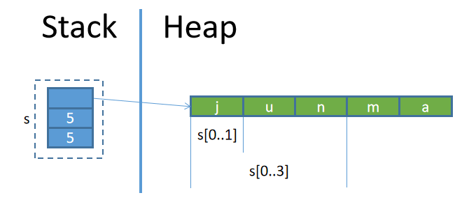
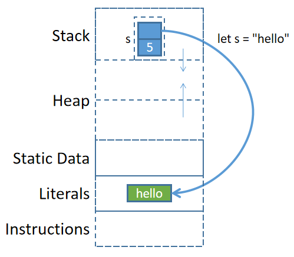

## 字符串

Rust中的字符串是一个难点，此处先简单介绍关于字符串的一部分内容，更多细节和用法留到后面再单独解释。

**Rust有两种字符串类型：str和String**。其中str是String的切片类型，也就是说，str类型的字符串值是String类型的字符串值的一部分或全部。

### 字符串字面量

字符串字面量使用双引号包围。

```rust
fn main(){
  let s = "junmajinlong.com";
  println!("{}", s);
}
```

上面赋值变量时进行了变量推导，推导出的变量数据类型为`&str`。因此，上述代码等价于：

```rust
fn main(){
  let s: &str = "junmajinlong.com";
  println!("{}", s);
}
```

实际上，字符串字面量的数据类型均为`&str`，其中str表示str类型，`&`表示该类型的引用，即一个指针。因此，`&str`表示的是**一个指向内存中str类型数据的指针，该指针所指向的内存位置处保存了字符串数据`"junmajinlong.com"`**。

至于为什么字符串字面量的类型是`&str`而不是`str`，后文再解释。

### String类型的字符串

String类型的字符串没有对应的字面量构建方式，只能通过Rust提供的方法来构建。

例如，可以通过字符串字面量(即`&str`类型的字符串)来构建。

```rust
fn main(){
  // 类型自动推导为: String
  let s = String::from("junmajinlong.com");
  let s1 = "junmajinlong".to_string();
  println!("{},{}", s, s1);
}
```

String类型的字符串可以原地修改。例如：

```rust
fn main(){
  let mut s = String::from("junmajinlong");
  s.push('.');        // push()可追加单个char字符类型
  s.push_str("com");  // push_str()可追加&str类型的字符串
  println!("{}", s);  // 输出：junmajinlong.com
}
```

### 理解str和String的联系和区别

> 注：这部分内容对刚接触Rust的人来说较难理解，可先跳过，等阅读了后面一些章节再回来看。

str类型的字符串和String类型的字符串是有联系的：**str字符串是String类型字符串的切片(slice)类型**。关于切片类型，参考[Slice类型](../ch3/08_slice.md)。

例如，变量s保存了String类型的字符串`junma`，那么`s[0..1]`就是**str类型**的字符串`j`，`s[0..3]`就是str类型的字符串`jun`。



例如：
```rust
fn main(){
  let s = String::from("junmajinlong.com");
  
  // 自动推导数据类型为&str
  //   s[0..3]的类型为str
  //  &s[0..3]的类型为&str
  let s_str = &s[0..3];  // 等价于&(s[0..3])而不是(&s)[0..3]
  // 现在s_str通过胖指针引用了源String字符串中的局部数据
  
  println!("{}", s_str);  // 输出：jun
}
```

前面说过，字符串字面量的类型是`&str`类型。也就是说，字符串字面量实际上是字符串切片类型的引用类型。

```rust
fn main(){
  // IDE中可看到下面的变量推导出的数据类型为&str
  let s = "hello";
}
```

那么字符串字面量是如何存储的呢？

对于字面量`"hello"`来说，并不是先在内存中以String类型的方式存储`"hello"`，然后再创建该String数据的引用来得到了一个`&str`的。

编译器对字符串字面量做了特殊处理：**编译器编译的时候直接将字符串字面量以硬编码的方式写入程序二进制文件中，当程序被加载时，字符串字面量被放在内存的某个位置(不在堆中也不在栈中，而是在类似于静态数据区的全局字面量区)**。当程序执行到`let s="hello";`准备将其赋值给变量s时(注：s在栈上)，直接将字面量内存区的该数据地址保存到`&str`类型的s中。



理解了这一点，再理解`let s = String::from("hello");`这样的代码就很容易了。编译器将`"hello"`硬编码写入程序二进制文件，程序加载期间字符串字面量被放入字面量内存区，当程序运行到`let s = String::from()`操作时，从字面量内存区将其拷贝到堆内存中，然后将堆内存中该数据的地址保存到栈内变量s中。


