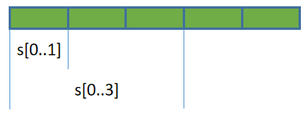

## Slice类型

Slice类型通常翻译为切片，它表示从某个包含多个元素的容器中取得局部数据，这个过程称为**切片操作**。不同语言对切片的支持有所不同，比如有些语言只允许取得连续的局部元素，而有些语言可以取得离散元素，甚至有些语言可以对hash结构进行切片操作。

Rust也支持Slice操作，Rust中的切片操作只允许获取一段连续的局部数据，切片操作获取到的数据称为**切片数据**。

Rust常见的数据类型中，有三种类型已支持Slice操作：String类型、Array类型和Vec类型(本文介绍的Slice类型自身也支持切片操作)。实际上，用户自定义的类型也可以支持Slice操作，只要自定义的类型满足一些条件即可，相关内容以后再介绍。

### slice操作

有以下几种切片方式：假设s是可被切片的数据  
- `s[n1..n2]`：获取s中index=n1到index=n2(不包括n2)之间的所有元素  
- `s[n1..]`：获取s中index=n1到最后一个元素之间的所有元素  
- `s[..n2]`：获取s中第一个元素到index=n2(不包括n2)之间的所有元素  
- `s[..]`：获取s中所有元素  
- 其他表示包含范围的方式，如`s[n1..=n2]`表示取index=n1到index=n2(包括n2)之间的所有元素

例如，从数据s中取第一个元素和取前三个元素的切片示意图如下：



**切片操作允许使用usize类型的变量作为切片的边界**。例如，n是一个usize类型的变量，那么`s[..n]`是允许的切片操作。

### slice作为数据类型

和其他语言的Slice不同，Rust除了支持切片操作，还将Slice上升为一种原始数据类型(primitive type)，切片数据的数据类型就是Slice类型。

**Slice类型是一个胖指针**，它包含两份元数据：  

- 第一份元数据是指向源数据中切片起点元素的指针  
- 第二份元数据是切片数据中包含的元素数量，即切片的长度  

例如，对于切片操作`s[3..5]`，其起点指针指向s中index=3处的元素，切片长度为2。

Slice类型的描述方式为`[T]`，其中`T`为切片数据的数据类型。例如对存放了i32类型的数组进行切片，切片数据的类型为`[i32]`。

由于切片数据的长度无法在编译期间得到确认(比如切片操作的边界是变量时`s[..n]`)，而编译器是不允许使用大小不定的数据类型的，因此无法直接去使用切片数据(比如无法直接将它赋值给变量)。

```rust
fn main(){
  let arr = [11,22,33,44,55];
  let n: usize = 3;

  // 编译错误，无法直接使用切片类型
  let arr_s = arr[0..n];
}
```

也因此，在**Rust中几乎总是使用切片数据的引用**。切片数据的引用对应的数据类型描述为`&[T]`或`&mut [T]`，前者不可通过Slice引用来修改源数据，后者可修改源数据。

> 注意区分Slice类型和数组类型的描述方式。
> 
> 数组类型表示为`[T; N]`，数组的引用类型表示为`&[T; N]`，Slice类型表示为`[T]`，Slice的引用类型表示为`&[T]`。

例如，对一个数组arr做切片操作，取得它的不可变引用`arr_slice1`和可变引用`arr_slice2`，然后通过可变引用去修改原数组的元素。

```rust
fn main(){
  let mut arr = [11,22,33,44];

  // 不可变slice
  let arr_slice1 = &arr[..=1];
  println!("{:?}", arr_slice1); // [11,22];

  // 可变slice
  let arr_slice2 = &mut arr[..=1];  
  arr_slice2[0] = 1111;
  println!("{:?}", arr_slice2);// [1111,22];
  println!("{:?}", arr);// [1111,22,33,44];
}
```

需要说明的一点是，虽然`[T]`类型和`&[T]`类型是有区别的，前者是切片类型，后者是切片类型的引用类型，但因为几乎总是通过切片类型的引用来使用切片数据，所以通常会去混用这两种类型(包括一些书籍也如此)，无论是`[T]`还是`&[T]`都可以看作是切片类型。

### 特殊对待的str切片类型

需要特别注意的是，**String的切片和普通的切片有些不同**。

一方面，String的切片类型是`str`，而非`[String]`，String切片的引用是`&str`而非`&[String]`。

另一方面，Rust为了保证字符串总是有效的Unicode字符，它不允许用户直接修改字符串中的字符，所以也无法通过切片引用来修改源字符串，除非那是ASCII字符(ASCII字符总是有效的unicode字符)。

事实上，Rust只为`&str`提供了两个转换ASCII大小写的方法来修改源字符串，除此之外，没有为字符串切片类型提供任何其他原地修改字符串的方法。

```rust
fn main(){
  let mut s = String::from("HELLO");
  let ss = &mut s[..];

  // make_ascii_lowercase()
  // make_ascii_uppercase()
  ss.make_ascii_lowercase();
  println!("{}", s);  // hello
}
```

### Array类型自动转换为Slice类型

在Slice的[官方手册](https://doc.rust-lang.org/std/slice/index.html)中，经常会看到将Array的引用`&[T;n]`当作Slice来使用。

例如：
```rust
let arr = [11,22,33,44];
let slice = &arr;   // &arr将自动转换为slice类型

// 调用slice类型的方法first()返回slice的第一个元素
println!("{}", slice.first().unwrap());  // 11
```

所以，**可以直接将数组的引用当成slice来使用**。即`&arr`和`&mut arr`当作不可变slice和可变slice来使用。

另外，在调用方法的时候，由于`.`操作符会自动创建引用或解除引用，因此**Array可以直接调用Slice的所有方法**。

例如：
```rust
let arr = [11, 22, 33, 44];

// 点运算符会自动将arr.first()转换为&arr.first()
// 而&arr又会自动转换为slice类型
println!("{}", arr.first().unwrap());
```

这里需要记住这个用法，但目前请忽略以上自动转换行为的内部原因，其涉及到尚未介绍的类型转换机制。

### Slice类型支持的方法

Slice支持很多方法，这里介绍几个比较常用的方法，更多方法可参考官方手册：<https://doc.rust-lang.org/std/primitive.slice.html#impl>。

> 注：这些方法都不适用于String Slice，String Slice可用的方法较少，上面给出官方手册中，除了方法名中有"ascii"的方法(如is_ascii()方法)是String Slice可使用的方法外，其他方法都不能被String Slice调用。

**一些常见方法**：  
- len()：取slice元素个数  
- is_empty()：判断slice是否为空  
- contains()：判断是否包含某个元素  
- repeat()：重复slice指定次数  
- reverse()：反转slice  
- join()：将各元素压平(flatten)并通过指定的分隔符连接起来  
- swap()：交换两个索引处的元素，如`s.swap(1,3)`  
- windows()：以指定大小的窗口进行滚动迭代  
- starts_with()：判断slice是否以某个slice开头  

例如：
```rust
let arr = [11,22,33];
println!("{}",   arr.len());  // 3
println!("{:?}", arr.repeat(2)); // [11, 22, 33, 11, 22, 33]
println!("{:?}", arr.contains(&22)); // true

// reverse()
let mut arr = [11,22,33];
arr.reverse();
println!("{:?}",arr); // [33,22,11]

// join()
println!("{}", ["junma","jinlong"].join(" ")); // junma jinlong
println!("{:?}", [[1,2],[3,4]].join(&0)); // [1,2,0,3,4]

// swap()
let mut arr = [1,2,3,4];
arr.swap(1,2);
println!("{:?}", arr); // [1,3,2,4]

// windows()
let arr = [10, 20, 30, 40];
for i in arr.windows(2) {
  println!("{:?}", i); // [10,20], [20,30], [30,40]
}

// starts_with()，相关的方法还有ens_with()
let arr = [10, 20, 30, 40];
println!("{}", arr.starts_with(&[10]));  // true
println!("{}", arr.starts_with(&[10, 20])); // true
println!("{}", arr.starts_with(&[30]));  // false
```

