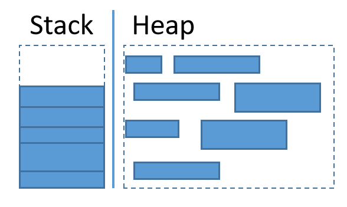

## Rust如何使用堆和栈

有些数据适合存放于堆，有些数据适合存放于栈。

**(1).栈适合存放存活时间短的数据**。

比如函数内部的局部变量适合存放在栈中，因为函数返回后，该函数中声明的局部变量就没有意义了，随着函数栈帧的释放，该栈中的所有数据也随之消失。

与之对应的，存活时间长的数据通常应该存放在堆空间中。比如多个函数(有不同栈帧)共用的数据应该存放在堆中，这样即使一个函数返回也不会销毁这份数据。

**(2).数据要存放于栈中，要求数据所属数据类型的大小是已知的**。因为只有这样，Rust编译器才知道在栈中为该数据分配多少内存。

与之对应的，如果无法在编译期间得知数据类型的大小，该数据将不允许存放在栈中，只能存放在堆中。

例如，i32类型的数据存放在栈中，因为i32类型的大小是固定的，无论对它做什么操作，只要它仍然是i32类型，那么它的大小就一定是4字节。而String类型的数据是存放在堆中的，因为String类型的字符串是可变而非固定大小的，最初初始化的时候可能是空字符串，但可以在后期向此空字符串中加入任意长度的字符串，编译器显然无法在编译期间就得知字符串的长度。

**(3).使用栈的效率要高于使用堆**。

将数据存放于栈中时，因为编译器已经知道将要存放于栈中数据的大小，所以编译器总是在栈帧中分配合适大小的内存来存放数据。另一方面，栈中数据的存放方式是后进先出。**这相当于编译器总是找好各种大小合适的盒子来存放数据并将盒子放在栈的顶部，而释放栈中数据的方式则是从栈顶拿走盒子**。

与之对应的是将数据存放于堆中时，当程序运行时会向操作系统申请一片空闲的堆内存空间，然后将数据存放进去。但是堆内存空间是无人管理的自由内存区，操作系统想要从堆中找到空闲空间需要做一些额外操作。更严重的是堆中有大量碎片内存的情况，操作系统可能会将多份小的碎片空闲内存通过链表的方式连接起来组成一个大的空闲空间分配给程序，这样的效率是非常低的。

对比堆和栈的使用方式，**显然以【盒子】为操作单位且总是跟踪栈顶的栈内存管理方式的效率要远高于堆**。

其实，可以将栈理解为将物品放进大小合适的纸箱并将纸箱按规律放进储物间，将堆理解为在储物间随便找一个空位置来放置物品。显然，以纸箱为单位来存取物品的效率要高的多，而直接将物品放进凌乱的储物间的效率要低的多，而且储物间随意堆放的东西越多，空闲位置就越零碎，存取物品的效率就越低，且空间利用率就越低。

用一张图来描述它们：



**(4).Rust将哪些数据存放于栈中**？

Rust中各种类型的值默认都存储在栈中，除非显式地使用`Box::new()`将它们存放在堆上。

但数据要存放在栈中，要求其数据类型的大小已知。对于静态大小的类型，可直接存储在栈上。

例如如下类型的数据存放在栈中：  

- 裸指针(一个机器字长)、普通引用(一个机器字长)、胖指针(除了指针外还包含其他元数据信息，智能指针也是一种带有额外功能的胖指针，而胖指针实际上又是Struct结构)  
- 布尔值  
- char  
- 各种整数、浮点数  
- 数组(Rust数组的元素数据类型和数组长度都是固定不变的)  
- 元组  

对于动态大小的类型(如Vec、String)，则数据部分分布在堆中(被称为allocate buffer)，并在栈中留下胖指针(Struct方式实现)指向实际的数据，栈中的那个胖指针结构是静态大小的(换句话说，动态类型以Vec为例，Vec类型的值理应是那些连续的元素，但因为这样的连续内存的大小是不确定的，所以改变了它的行为，它的值是那个栈中的胖指针，而不是存储在allocatge buffer中的实际数据)。

以上分类需要注意几点：  

- 将栈中数据赋值给变量时，数据直接存放在栈中。比如i32类型的33，33直接存放在栈内，而不是在堆中存放33并在栈中存放指向33的指针  
- 因为类型的值默认都分布在栈中(即便是动态类型的数据，但也通过胖指针改变了该类型的值的表现形式)，所以创建某个变量的引用时，引用的是栈中的那个值  
- 有些数据是0字节的，不需要占用空间，比如`()`  
- 尽管【容器】结构中(如数组、元组、Struct)可以存放任意数据，但保存在容器中的要么是原始类型的栈中值，要么是指向堆中数据的引用，所以这些容器类型的值也在栈中。例如，对于`struct User {name: String}`，name字段存储的是String类型的胖指针，String类型实际的数据则在堆中  
- 尽管`Box::new(T)`可以将类型T的数据放入堆中，但Box类型本身是一个struct，它是一个胖指针(更严格地说是智能指针)，它在栈中  

实际上，对于理解来说，只有Box才能让数据存放到堆中，但对于实现上，只有调用alloc才能申请堆内存并将数据存放在堆中。比如，自己想实现一个类型，将某些数据明确存放在堆中，那么必须要在实现代码中调用alloc来分配堆内存，但同时，要实现的这个类型本身，它的值是在栈中的。

**(5).Rust除了使用堆栈，还使用全局内存区(静态变量区和字面量区)**。

Rust编译器会将全局内存区的数据直接嵌入在二进制程序文件中，当启动并加载程序时，嵌入在全局内存区的数据被放入内存的某个位置。

全局内存区的数据是编译期间就可确定的，且存活于整个程序运行期间。

**字符串字面量、static定义的静态变量(相当于全局变量)都会硬编码嵌入到二进制程序的全局内存区**。

例如：

```rust
fn main(){
  let _s = "hello";     // (1)
  let _ss = String::from("hello"); // (2)
  let _arr = ["hello";3];    // (3)
  let _tuple = ("hello",);   // (4)
  // ...
}
```

上面代码中的几个变量都使用了字符串字面量，且使用的都是相同的字面量`"hello"`，在编译期间，它们会共用同一个`"hello"`，该`"hello"`会硬编码到二进制程序文件中。当程序被加载到内存时，该被放入到全局内存区，它在全局内存区有自己的内存地址，当运行到以上各行代码时：

- 代码(1)、(3)、(4)，将根据地址取得其引用，并分别保存到变量`_s`、`_arr`各元素、`_tuple`元素中   
- 代码(2)，将根据地址取得数据并将其拷贝到堆中(转换为`Vec<u8>`的方式存储，它是String类型的底层存储方式)  

**(6).Rust中允许使用const定义常量。常量将在编译期间直接以硬编码的方式内联(inline)插入到使用常量的地方**。

所谓内联，即将它代表的值直接替换到使用它的地方。

比如，定义了常量ABC=33，在第100行和第300行处都使用了常量ABC，那么在编译期间，会将33硬编码到第100行和第300行处。

Rust中，除了const定义的常量会被内联，某些函数也可以被内联。将函数进行内联，表示将该函数对应的代码体直接展开并插入到调用该函数的地方，这样就没有函数调用的开销(比如没有调用函数时申请栈帧、在寄存器保存某些变量等的行为)，效率会更高一些。但只有那些频繁调用的短函数才适合被内联，并且内联会导致程序的代码膨胀。

