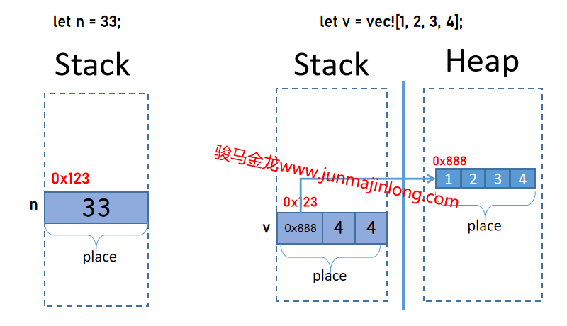
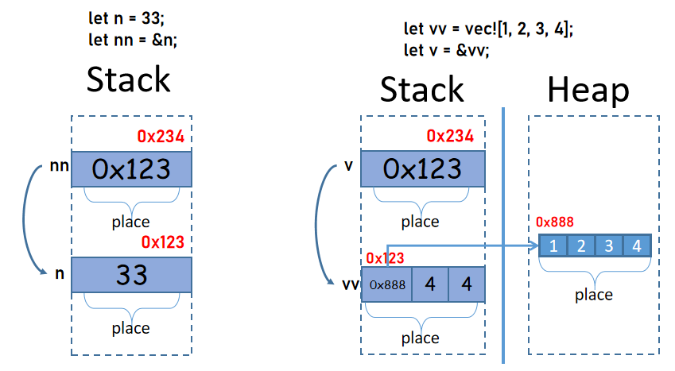
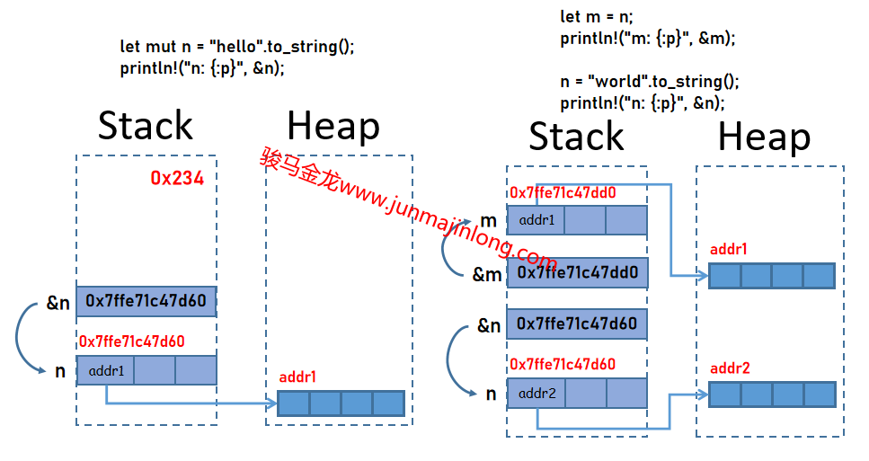

## Rust位置表达式和值

在Rust中，非常有必要理解的概念是位置表达式和值，或者简化为`位置`和`值`，理解这两个概念，对理解Rust的内存布局、引用、指针、变量等等都有很大帮助。

**位置**就是某一块内存位置，它有自己的地址，有自己的空间，有自己所保存的值。每一个**位置**，可能位于栈中，可能位于堆中，也可能位于全局内存区。

**值**就是存储到位置中的数据(即保存在内存中的数据)。值的类型有多种，如数值类型的值、字符类型的值、指针类型的值(包括裸指针和胖指针)，等等。

### 通过示例来理解变量、位置和值的关系

最简单的，`let`声明变量时，需要产生一个位置来存放数据。

对于下面的代码：

```rust
let n = 33;
```

对应的内存如下图左侧所示。

其中：

- n称为变量名。变量名是语言层面上提供的一个别名，它是对内存位置的一个人类可读的代号名称，在编译期间，变量名会被移除掉并替换为更低级的代号甚至替换为内存地址  
- 这里的变量名n对应栈中的一个位置，这个位置中保存了值33  
- 位置有自己的内存地址，如图中的`0x123`  
- 有时候，会将这种声明变量时的位置看作是变量(注意不是变量名)，或者将变量看作是位置。无论如何看待两者，我们内心需要明确的是，变量或这种位置，是栈中的一块内存  
- 每个位置(或变量)，都是它所存放的值的所有者。因为每个值都只能存放在一个位置中，所以每个值都只能有一个所有者  



上面是将数值33赋值给变量，Rust中的i32是原始数据类型，默认i32类型的值直接保存在栈中。因此，左图的内存位置中，仅仅只是保存了一个数值33。

如果赋值给变量的是保存在堆中的数据(例如Vec类型)，那么变量中保存的是该数据的胖指针。

```rust
let v = vec![1, 2, 3, 4];
```

其内存布局如右图所示。在右图中，有两个位置：一个位置在堆内存中，用于存放实际数据，它是由一连串空间连续的小位置组成的一个大位置，每个小位置存放了对应的值；第二个位置在栈中，它存放的是Vec的胖指针。

这两个位置都有自己的地址，都有自己的值。其中，**栈中的那个位置，是变量声明时显式创建的位置，这个位置代表的是Vec类型的变量，而堆中的位置是自动隐式产生的，这个位置和变量没有关系，唯一的关联是栈中的那个位置中有一根指针指向这个堆中的位置**。

需要说明的是，对于上面的Vec示例，Vec的值指的是存放在栈中那个位置内的数据，而不是堆中的存放的实际数据。也就是说，**变量v的值是那个胖指针，而不是堆中的那串实际数据。更严格地说，Vec类型的值，指的是那个胖指针数据，而不是实际数据，变量v的值是那个胖指针而不是实际数据，变量v是胖指针这个值的所有者，而不是实际数据的所有者**。这种变量和值之间的关系和其它某些语言可能有所不同。

### 理解变量的引用

Rust中的引用是一种指针，只不过Rust中还附带了其它编译期特有的含义，例如是引用会区分是否可变、引用是借用概念的实现形式。

但不管如何，**Rust中的引用是一种原始数据类型，它的位置认在栈中，保存的值是一种地址值，这个地址指向它所引用的目标**。

关键问题，引用所指向的这个**目标**是谁呢？这里有几种让人疑惑的指向可能：

- (1).指向它所指向的那个变量(即指向位置)  
- (2).指向位置中的值  
- (3).指向原始数据  

在Rust中，正确的答案是：**指向位置**。(参考链接：[Operator expressions - The Rust Reference (rust-lang.org)](https://doc.rust-lang.org/reference/expressions/operator-expr.html#borrow-operators))

例如：

```rust
let n = 33;
let nn = &n;
```

在这个示例中，变量n对应栈中的一个位置，这个位置中保存了数据值33，这个位置有一个地址0xabc，而对于变量nn，它也对应栈中的一个位置，这个位置中保存了一个地址值，这个地址的值为0xabc，即指向变量n的位置。



实际上，上面的三种可能中，(1)和(2)没有区别，因为值和位置是绑定的，指向值和指向位置本就是相同的，但是有的地方说是指向值的，理由是不能对未赋值过的的变量进行引用，不能对值被移走的变量进行引用(所以位置和某个值不总是绑定在一起的)。但换一个角度思考，Rust编译器会在建立引用的时候先推断好此刻能否引用，只要能成功建立引用，(1)和(2)就没有区别。

为什么引用中的地址不是指向原始数据呢？例如，对于下面的示例，变量v为什么不是指向堆中的那个位置的？

```rust
let vv = vec![1, 2, 3, 4];
let v = &vv;
```

从位置和值的角度来理解。例如上面的`let v = &vv;`，vv是一个位置，这个位置保存的是Vec的胖指针数据，也就是说，vv的值是这个胖指针而不是堆中的那块实际数据，所以v引用vv时，引用的是vv的位置，而不是实际数据。

此外，Rust的宗旨之一就是保证安全，不允许存在对堆中同一个内存的多个指向，因为这可能会导致重复释放同一块堆内存的危险。换句话说，至始至终，只有最初创建这块堆内存的vv变量才指向堆中这块数据。当然，vv中的值(即栈中位置中保存的值)可能会被移给另外一个变量，那么这个接收变量就会成为唯一一个指向堆中数据的变量。

为什么不允许对堆中同一个内存的多个指向，却允许对栈中同一个数据的多个指向呢？例如，下面的代码中，变量x和变量y中保存的地址都指向变量n的位置：

```rust
let n = 33;
let x = &n;
let y = &n;
```

这是因为栈内存由编译器负责维护，编译器知道栈中的某个内存是否安全(比如判断变量是否离开作用域被销毁、判断生命周期)，而堆内存是由程序员负责维护，程序员的行为是不安全的。

说了这么多，大概也能体会到一点Rust的行为模式了：尽可能地让涉及到内存安全的概念实现在栈上，尽可能让程序员远离对堆内存的操作。

### 何时创建位置和值

以下几种常见的情况会产生位置：

- 变量初始化时会产生位置(严格来说，是变量声明后产生位置，但未赋值的变量不能使用，且会被优化掉)  
- 调用函数时的参数和返回值会产生位置  
- 模式匹配过程中如果使用了变量则也会产生位置  
- 引用和解引用也会产生位置

作为总结：

- **会产生变量的时候，就会产生位置**  
- **需要保存某个值的时候，就会产生位置**
- **会产生新值的时候(例如引用会新产生一个地址值，解引用会产生对应的结果值)，就会产生位置**  
- **使用值的时候，就会产生位置**  

其中有的位置是临时的中间变量，例如引用产生值会先保存在临时变量中。

以上是显式产生位置的方式，还有隐式产生的位置。例如，在初始化一个vec并赋值给变量时，堆内存中的那个位置就是隐式创建的。**本文中出现的位置，指的都是栈中的位置**，也就是由编译器负责维护的位置，本文完全不考虑堆内存中的位置，因为堆中的位置和我们理解Rust的各种规则没有关系，Rust暴露给程序员的、需要程序员理解的概念，几乎都在栈中。

为什么要理解何时产生位置呢？这涉及到了Move语义和Copy语义。如果不知道何时会产生位置，在对应情况下可能就会不理解为什么会发生移动行为。

例如，match模式匹配时，在分支中使用了变量，可能会发生移动。

```rust
#[derive(Debug)]
struct User {
  vip: VIP,
}

#[derive(Debug)]
enum VIP {
  VIP0,
  VIP1,
  VIP2,
  VIP3,
}

fn main() {
  let user = User {vip: VIP::VIP0};
  match user.vip {
    VIP::VIP0 => println!("not a vip"),
    a => println!("vip{:?}", a),   // "声明"了变量a，发生move
    // ref a => println!(), // 借用而不move
  }
  println!("{:?}", user);   // 报错
}
```

在上面的match匹配代码中，第二个分支使用了变量a，尽管匹配时会匹配第一个分支，但Rust编译器并不知道匹配的结果如何，因此编译器会直接move整个user到这个分支(注：从Rust 2021开始，不会再因为要移动某个内部元素而移动整个容器结构，因此Rust 2021版中，不再move整个user，而是只move单独的user.vip字段)。

**位置一旦初始化赋值，就会有一个永远不变的地址，直到销毁。换句话说，变量一旦初始化，无论它之后保存的数据发生了什么变化，它的地址都是固定不变的。也说明了，编译器在编译期间就已经安排好了所有位置的分配**。

```rust
fn main() {
  let mut n = "hello".to_string();  // n是一个栈中的位置，保存了一个胖指针指向堆中数据
  println!("n: {:p}", &n);  // &n产生一个位置，该位置中保存指向位置n的地址值
  
  let m = n;     // 将n中的胖指针移给了m，m保存胖指针指向堆中数据，n变回未初始化状态
  println!("m: {:p}", &m);  // &m产生一个位置，该位置中保存指向位置m的地址值
  
  n = "world".to_string();  // 重新为n赋值，位置n保存另一个胖指针，但位置n还是那个位置
  println!("n: {:p}", &n);  // &n产生一个位置，该位置中保存指向位置n的地址值
}
```

输出结果：

```
n: 0x7ffe71c47d60
m: 0x7ffe71c47dd0
n: 0x7ffe71c47d60
```

它的内存分布大概如下：



### 位置和值与Move语义、Copy语义的关联

在Rust中，赋值操作，实际上是一种值的移动：将值从原来的位置移入到目标位置。如果类型实现了Copy trait，则Copy而非Move。

例如：

```rust
let x = 3;
```

这个简单的语句实际上会先声明一个变量，刚声明时的变量并未赋值(或者按照某种说法，被初始化为初始值)，在某个之后的地方才开始将数值数值3赋值给变量，这里赋值的过程是一个移动操作。

大概过程如下：

```rust
let x i32;
...
x = 3;
```

将变量赋值给其它变量，就更容易理解了，要么将源变量位置中的值(注意是位置中的值，不是实际数据)移动到目标位置，要么将位置中的值拷贝到目标位置。

### 位置的状态标记

比较复杂的是，位置不仅仅只是一个简单的内存位置，它还有各种属性和状态，这些属性和状态都是编译期间由编译器维护的，不会保留到运行期间。

包括且可能不限于如下几种行为：  

- 位置具有类型(需注意，Rust中变量有类型，值也有类型)  
- 位置保存它的值是否正在被引用以及它是共享引用还是独占引用的标记([borrow operators](https://doc.rust-lang.org/reference/expressions/operator-expr.html#borrow-operators): The memory location is also placed into a borrowed state for the duration of the reference)  
- 还能根据位置的类型是否实现了Copy Trait来决定该位置的值是移走还是拷贝走  

更多关于借用和移动语义、拷贝语义，留待后文。