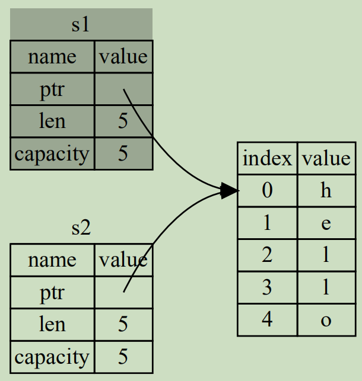
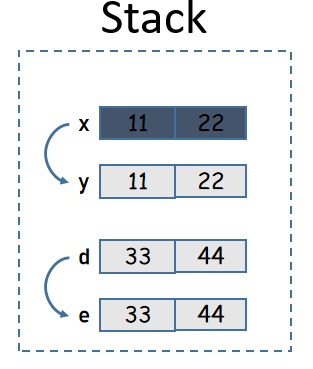

## Rust所有权规则概述

Rust的所有权(ownership)规则贯穿整个语言，几乎每行代码都涉及到所有权规则，因此需要对所有权规则非常熟悉才能更好地使用Rust。

Rust所有权规则可以总结为如下几句话：  
- **Rust中的每个值都有一个被称为其所有者的变量**(即：值的所有者是某个变量)  
- **值在任一时刻有且只有一个所有者**  
- **当所有者(变量)离开作用域，这个值将被销毁**  

这里对第三点做一些补充性的解释，所有者离开作用域会导致值被销毁，这个过程实际上是调用一个名为drop的函数来销毁数据释放内存。在前文解释作用域规则时曾提到过，销毁的数据特指堆栈中的数据，如果变量绑定的值是全局内存区内的数据，则数据不会被销毁。

例如：
```rust
fn main(){
  {
    let mut s = String::from("hello");
  } // 跳出作用域，栈中的变量s将被销毁，其指向的堆
    // 中数据也被销毁，但全局内存区的字符串字面量仍被保留
}
```

## 谁是谁的所有者

Rust中每个值都有一个所有者，但这个说法比较容易产生误会。

例如：

```rust
let s = String::from("hello");
```

多数人可能会误以为变量s是堆中字符串数据`hello`的所有者，但实际上不是。

前面介绍内存的文章中解释过，String字符串的实际数据在堆中，但是String大小不确定，所以在栈中使用一个胖指针结构来表示这个String类型的数据，这个胖指针中的指针指向堆中的String实际数据。也就是说，变量s的值是那个胖指针，而不是堆中的实际数据。

因此，变量s是那个胖指针的所有者，而不是堆中实际数据的所有者。

但是，由于胖指针是指向堆中数据的，多数时候为了简化理解简化描述方式，也经常会说s是那个堆中实际数据的所有者。但无论如何描述，需要理解所有者和值之间的真相。

## Rust中数据的移动

在其他语言中，有深拷贝和浅拷贝的概念，浅拷贝描述的是只拷贝数据对象的引用，深拷贝描述的是根据引用递归到最终的数据并拷贝数据。

在Rust中没有深浅拷贝的概念，但有移动(move)、拷贝(copy)和克隆(clone)的概念。

看下面的赋值操作，在其他语言中这样赋值是正确的，但在Rust中这样的赋值会报错。
```rust
fn main(){
  let s1 = String::from("hello");
  let s2 = s1;

  // 将报错error: borrow of moved value: `s1`
  println!("{},{}", s1, s2); 
}
```

上面的示例中，变量s1绑定了String字符串数据(再次提醒，String数据是胖指针结构而不是指堆中的那些实际数据)，此时该数据的所有者是s1。

当执行`let s2 = s1;`时，将不会拷贝堆中数据赋值给s2，也不会像其他语言一样让变量s2也绑定堆中数据(即，不会拷贝堆数据的引用赋值给s2)。

因此，下图的内存引用方式不适用于Rust。


如果Rust采用这种内存引用方式，按照Rust的所有权规则，变量在跳出作用域后就销毁堆中对应数据，那么在s1和s2离开作用域时会导致**二次释放**同一段堆内存，这会导致内存污染。

Rust采用非常直接的方式，当执行`let s2 = s1;`时，直接让s1无效(s1仍然存在，只是变成未初始化变量，Rust不允许使用未初始化变量，可重新为其赋值)，而是只让s2绑定堆内存的数据。也就是**将s1移动到s2**，也称为**值的所有权从s1移给s2**。

如图：



### 所有权移动后修改数据

定义变量的时候，加上`mut`表示变量可修改。当发生所有权转移时，后拥有所有权的变量也可以加上`mut`。

```rust
let mut x = String::from("hello");

// x将所有权转移给y，但y无法修改字符串
let y = x;   
// y.push('C');  // 本行报错

let a = String::from("hello");
// 虽然a无法修改字符串，但转移所有权后，b可修改字符串
let mut b = a; 
b.push('C');   // 本行不报错
```

### 移动真的只是移动吗？

比如下面的示例：
```rust
let s1 = String::from("hello");
let s2 = s1;
```

上面已经分析过，值的所有权会从变量s1转移到变量s2，所有权的转移，涉及到的过程是拷贝到目标变量，同时重置原变量到未初始状态，整个过程就像是进行了一次数据的移动。但注意，上面示例中拷贝的是栈中的胖指针，而不是拷贝堆中的实际数据，因此这样的拷贝效率是相对较高的。

所有权转移之后，将只有新的所有者才会指向堆中的实际数据，而原变量将不再指向堆中实际数据，因此所有权转移之后仍然只有一个指针指向堆中数据。

Move不仅发生在变量赋值过程中，在函数传参、函数返回数据时也会Move，因此，如果将一个大对象(例如包含很多数据的数组，包含很多字段的struct)作为参数传递给函数，是否会让效率很低下？

按照上面的结论来说，确实如此。但Rust编译器会对Move语义的行为做出一些优化，简单来说，当数据量较大且不会引起程序正确性问题时，它会传递大对象的指针而非内存拷贝。

此外，对于胖指针类型的变量(如Vec、String)，即使发生了拷贝，其性能也不差，因为拷贝的只是它的胖指针部分。

总之，Move虽然发生了内存拷贝，但它的性能并不会太受影响。

此处部分结论参考：<https://stackoverflow.com/questions/30288782/what-are-move-semantics-in-rust>。

## Copy语义

默认情况下，在将一个值保存到某个位置时总是进行值的移动(实际上是拷贝)，使得只有目标位置才拥有这个值，而原始变量将变回未初始化状态，也就是暂时不可用的状态。这是Rust的移动语义。

Rust还有Copy语义，和Move语义几乎相同，唯一的区别是Copy后，原始变量仍然可用。

前面说过，Move实际上是进行了拷贝，只不过拷贝后让原始变量变回未初始化状态了，而Copy的行为，就是保留原始变量。

但Rust默认是使用Move语义，如果想要使用Copy语义，要求要拷贝的数据类型实现了Copy Trait。

例如，i32默认就已经实现了Copy Trait，因此它在进行所有权转移的时候，会自动使用Copy语义，而不是Move语义。

```rust
let x = 3;   // 3是原始数据类型，它直接存储在栈中，所以x变量的值是3，x拥有3
let n = x;   // Copy x的值(即3)到变量n，n现在拥有一个3，但x仍然拥有自己的3
```

Rust中默认实现了Copy Trait的类型，包括但不限于：  
- 所有整数类型，比如u32  
- 所有浮点数类型，比如f64  
- 布尔类型，bool，它的值是true和false  
- 字符类型，char  
- 元组，当且仅当其包含的类型也都是Copy的时候。比如`(i32, i32)`是Copy的，但`(i32, String)`不是  
- 共享指针类型或共享引用类型  

对于那些没有实现Copy的自定义类型，可以手动去实现Copy(要求同时实现Clone)，方式很简单：
```rust
#[derive(Copy, Clone)]
struct Abc(i32, i32);
```

下面是实现了Copy和未实现Copy时的一个对比示例：

```rust
#[derive(Debug)]
struct Xyz(i32, i32);

#[derive(Copy, Clone, Debug)]
struct Def(i32, i32);

fn main() {
  let x = Xyz(11, 22);
  let y = x;
  // println!("x: {}", x); // 报错
  println!("y: {:?}", y);

  let d = Def(33, 44);
  let e = d;
  println!("d: {:?}", d);
  println!("e: {:?}", e);
}
```



## 克隆数据

虽然实现Copy Trait可以让原变量继续拥有自己的值，但在某些需求下，不便甚至不能去实现Copy。这时如果想要继续使用原变量，可以使用`clone()`方法手动拷贝变量的数据，同时不会让原始变量变回未初始化状态。

```rust
fn main(){
  let s1 = String::from("hello");
  // 克隆s1，克隆之后，变量s1仍然绑定原始数据
  let s2 = s1.clone();
  println!("{},{}", s1, s2);
}
```

但不是所有数据类型都可以进行克隆，只有那些实现了Clone Trait的类型才可以进行克隆(Trait类似于面向对象语言中的接口，如果不了解可先不管Trait是什么)，常见的数据类型都已经实现了Clone，因此它们可以直接使用clone()来克隆。

对于那些没有实现Clone Trait的自定义类型，需要手动实现Clone Trait。在自定义类型之前加上`#[derive(Clone)]`即可。例如：
```rust
#[derive(Clone)]
struct Abc(i32, i32);
```

这样Abc类型的值就可以使用clone()方法进行克隆。

要注意Copy和Clone时的区别，如果不考虑自己实现Copy trait和Clone trait，而是使用它们的默认实现，那么：

- Copy时，只拷贝变量本身的值，如果这个变量指向了其它数据，则不会拷贝其指向的数据  
- Clone时，拷贝变量本身的值，如果这个变量指向了其它数据，则也会拷贝其指向的数据  

也就是说，Copy是浅拷贝，Clone是深拷贝，Rust会对每个字段每个元素递归调用clone()，直到最底部。

例如：

```rust
fn main() {
  let vb0 = vec!["s1".to_string()];
  let v = vec![vb0];
  println!("{:p}", &v[0][0]);     // 0x21c43a20c50

  let vc = v.clone();
  println!("{:p}", &vc[0][0]);  // 0x21c43a20b70
}
```

所以，使用Clone的默认实现时，clone()操作的性能是较低的。但可以自己实现自己的克隆逻辑，也不一定总是会效率低。比如Rc，它的clone用于增加引用计数，同时只拷贝少量数据，它的clone效率并不低。

## 函数参数和返回值的所有权移动

**函数参数类似于变量赋值，在调用函数时，会将所有权移动给函数参数**。

**函数返回时，返回值的所有权从函数内移动到函数外变量**。

例如：
```rust
fn main(){
  let s1 = String::from("hello");
  
  // 所有权从s1移动到f1的参数
  // 然后f1返回值的所有权移动给s2
  let s2 = f1(s1); 
  // 注意，println!()不会转移参数s2的所有权
  println!("{}", s2);

  let x = 4;
  f2(x);     // 没有移动所有权，而是拷贝一份给f2参数
}  // 首先x跳出作用域，
   // 然后s2跳出作用域，并释放对应堆内存数据，
   // 最后s1跳出作用域，s1没有所有权，所以没有任何其他影响

fn f1(s: String) -> String {
  let ss = String::from("world"); 
  println!("{},{}", s,ss);
  s  // 返回值s的所有权移动到函数外
}    // ss跳出作用域

fn f2(i: i32){
  println!("{}",i);
}   // i跳出作用域
```

很多时候，变量传参之后丢失所有权是非常不方便的，这意味着函数调用之后，原变量就不可用了。为了解决这个问题，可以将变量的**引用**传递给参数。引用是保存在栈中的，它实现了Copy Trait，因此在传递引用时，所有权转移的过程实际上是拷贝了引用，这样不会丢失原变量的所有权，效率也更高。

