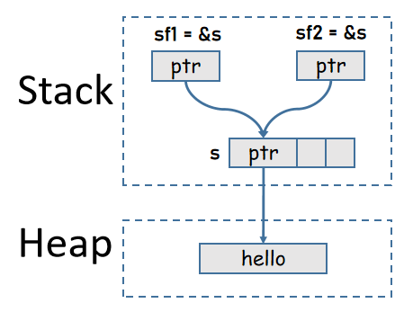

## 引用和所有权借用

所有权不仅可以转移(原变量会丢失数据的所有权)，还可以通过引用的方式来借用数据的所有权(borrow ownership)。

使用引用借用变量所有权时，【借完】之后会自动交还所有权，从而使得原变量不丢失所有权。至于什么时候【借完】，尚无法在此深究。

例如：
```rust
fn main(){
  {
    let s = String::from("hello");
    let sf1 = &s; // 借用
    let sf2 = &s; // 再次借用
    println!("{}, {}, {}",s, sf1, sf2);
  }  // sf2离开，sf1离开，s离开
}
```

注意，`&s`表示创建变量s的引用，为某个变量创建引用的过程不会转移该变量所拥有的所有权。



(不可变)引用实现了Copy Trait，因此下面的代码是等价的：

```rust
// 多次创建s的引用，并将它们赋值给不同变量
let sf1 = &s;
let sf2 = &s;

// 拷贝sf1，使得sf2也引用s，
// 但sf1是引用，是可Copy的，因此sf1仍然有效，即仍然指向数据
let sf1 = &s;
let sf2 = sf1;
```

还可以将变量的引用传递给函数的参数，从而保证在调用函数时变量不会丢失所有权。

```rust
fn main(){
  let s = String::from("hello");
  let s1 = s.clone();

  // s1丢失所有权，s1将回到未初始化状态
  f1(s1); 
  // println!("{}", s1);

  // 传递s的引用，借用s所有权 
  let l = f2(&s);
              // 交还所有权
  // s仍然可用
  println!("{} size: {}", s, l);
}

fn f1(s: String){
  println!("{}", s);
}

fn f2(s: &String)->usize{
  s.len()   // len()返回值类型是usize
}
```

## 可变引用和不可变引用的所有权规则

变量的引用分为**可变引用`&mut var`和不可变引用`&var`**，站在所有权借用的角度来看，可变引用表示的是可变借用，不可变引用表示的是不可变借用。

- 不可变借用：借用只读权，不允许修改其引用的数据  
- 可变引用：借用可写权(包括可读权)，允许修改其引用的数据  
- 多个不可变引用可共存(可同时读)  
- 可变引用具有排他性，在有可变引用时，不允许存在该数据的其他可变和不可变引用  
   - 这样的说法不准确，短短几句话也无法描述清楚，因此留在后面再详细解释  

前面示例中`f2(&s)`传递的是变量s的不可变引用`&s`，即借用了数据的只读权，因此无法在函数内部修改其引用的数据值。

如要使用可变引用去修改数据值，要求：  
- var的变量可变，即`let mut var = xxx`  
- var的引用可变，即`let varf = &mut var`  

例如：
```rust
fn main(){
  let mut x = String::from("junmajinlong");
  let x_ref = &mut x;  // 借用s的可写权
  x_ref.push_str(".com");
  println!("{}", x);

  let mut s = String::from("hello");
  f1(&mut s);   // 借用s的可写权
  println!("{}", s);
}

fn f1(s: &mut String){
  s.push_str("world");
}
```

## 容器集合类型的所有权规则

前面所介绍的都是标量类型的所有权规则，此处再简单解释一下容器类型(比如tuple/array/vec/struct/enum等)的所有权。

容器类型中可能包含栈中数据值(特指实现了Copy的类型)，也可能包含堆中数据值(特指未实现Copy的类型)。例如：

```rust
let tup = (5, String::from("hello"));
```

**容器变量拥有容器中所有元素值的所有权**。

因此，当上面tup的第二个元素的所有权转移之后，tup将不再拥有它的所有权，这个元素将不可使用，tup自身也不可使用，但仍然可以使用tup的第一个元素。

```rust
let tup = (5, String::from("hello"));

// 5拷贝后赋值给x，tup仍有该元素的所有权
// 字符串所有权转移给y，tup丢失该元素所有权
let (x, y) = tup;    
println!("{},{}", x, y);   // 正确
println!("{}", tup.0);     // 正确
println!("{}", tup.1);  // 错误
println!("{:?}", tup);  // 错误
```

如果想要让原始容器变量继续可用，要么忽略那些没有实现Copy的堆中数据，要么clone()拷贝堆中数据后再borrow，又或者可以引用该元素。

```rust
// 方式一：忽略
let (x, _) = tup;
println!("{}", tup.1);  //  正确

// 方式二：clone
let (x, y) = tup.clone();
println!("{}", tup.1);  //  正确

// 方式三：引用
let (x, ref y) = tup;
println!("{}", tup.1);  //  正确
```


