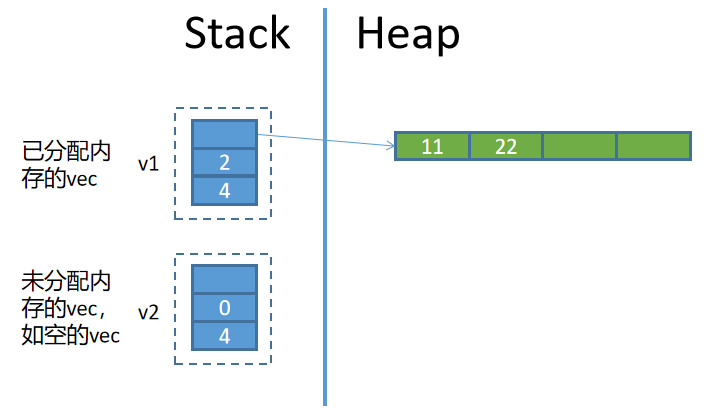

## Vec的内存布局

**Vec所存储的数据部分在堆内存中，同时在栈空间中存放了该vec的胖指针**。胖指针包括三部分元数据：

- 指向堆的指针(一个机器字长)  
- 当前vec元素数量(即长度，usize，一个机器字长)  
- vec的容量(即当前vec最多可存放多少元素，usize，一个机器字长)  

因此，vec的内存布局大致如下：  



### vec扩容：重新分配内存

当向vec插入新元素时，**如果没有空闲容量，则会重新申请一块内存，大小为原来vec内存大小的两倍**([官方手册](https://doc.rust-lang.org/std/vec/struct.Vec.html#guarantees)指明目前Rust并没有确定扩容的策略，以后可能会改变)，然后将原vec中的元素拷贝到新内存位置处，同时更新vec的胖指针中的元数据。

例如，有一个容量为10、长度为0的空vec，向该vec中插入前10个元素时不会重新分配内存，但在插入第11个元素时，因容量不够，会重新申请一块内存，容量为20，然后将前10个元素拷贝到新内存位置并将第11个元素放入其中。

通过vec的`len()`方法可获取该vec当前的元素数量，`capacity()`方法可获取该vec当前的容量大小。

```rust
fn main(){
  let mut v1 = vec![11,22,33];
  // len: 3, cap: 3
  println!("len: {}, cap: {}", v1.len(), v1.capacity());
  
  // push()向vec中插入一个元素，将导致扩容，
  // 扩容将导致重新分配vec的内存
  v1.push(44);
  // len: 4, cap: 6
  println!("len: {}, cap: {}", v1.len(), v1.capacity());
}
```

显然，**当频繁扩容或者当元素数量较多且需要扩容时，大量的内存拷贝会降低程序的性能**。

因此，如果可以的话，可以采取如下方式：

- 在创建vec的时候使用`Vec::with_capacity()`指定一个足够大的容量值，以此来尽量减少可能的内存拷贝。
- 通过`reserve()`方法来调整已存在的vec容量，使之至少有指定的空闲容量数，以此来尽量减少可能的内存拷贝。

例如：

```rust
fn main(){
  // 创建一个容量为3的空vec
  let mut v1 = Vec::with_capacity(3);
  v1.push(11);
  v1.push(22);
  v1.push(33);
  // len: 3, cap: 3
  println!("len: {}, cap: {}", v1.len(), v1.capacity());

  // 调整v1，使其至少要有10个空闲位置
  v1.reserve(10);
  // len: 3, cap: 13
  println!("len: {}, cap: {}", v1.len(), v1.capacity());
  
  // 当空闲容量足够时，reserve()什么也不做
  v1.reserve(5);
  println!("len: {}, cap: {}", v1.len(), v1.capacity());
}
```

另外，可以使用`shrink_to_fit()`方法来释放剩余的容量。一般情况下，不会主动去释放容量。


