# systemd时代的开机启动流程(UEFI+systemd)

计算机启动流程可以分为几个大阶段：

- 内核加载前  
  - 本阶段和操作系统无关，Linux或Windows或其它系统在这阶段的顺序是一样的  
- 内核加载中-->内核启动完成  
- 内核加载后-->系统环境初始化完成  
- 终端加载、用户登录  

这几个阶段中又有很多小阶段，每个阶段都各司其职。本文将主要介绍UEFI+systemd环境下的Linux系统启动流程，如果想要了解Bios+MBR+SysV环境下的详细系统启动流程(如CentOS 6)，可参考我以前写的一篇非常详细的文章[CentOS 6开机流程(Bios+MBR+SysV)](https://www.junmajinlong.com/linux/boot_process_bios_mbr)，在需要的时候，本文也会稍微介绍一些Bios+MBR+SysV的内容以作比较和整合。

## 开机流程图预览

下图是开机的全局流程图，具体的细节后文再详细描述。

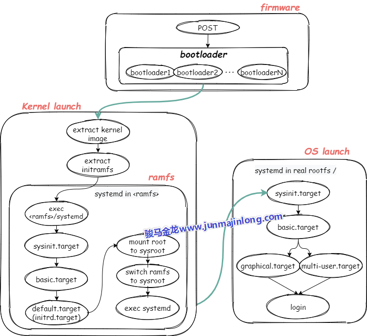

## 按下电源和固件阶段

按下电源，计算机开始通电，最重要的是要接通cpu的电路，然后通过cpu的针脚让cpu运行起来，只有cpu运行起来才能执行相关代码跳到第一个程序：bios或uefi上，并将CPU控制权交给bios或uefi程序。

下面不考虑从网络启动系统的方式，只考虑启动本地系统。

### 使用bios的固件阶段

对于BIOS来说，BIOS的工作包括：  

- (1).POST，即加电对部分硬件进行检查  
- (2).POST自检之后，BIOS初始化一部分启动所需的硬件(比如会启动磁盘，某些机器可能还会启动键盘)  
- (3).根据启动顺序找到排在第一位的磁盘  
- (4).BIOS跳转到所选择磁盘的前446字节，这446字节的代码是第一个bootloader程序，BIOS加载bootloader并将CPU控制权交给bootloader程序  
  - 磁盘的第一个扇区(前512字节)称为MBR，其中前446字节是bootloader程序，中间64字节是磁盘分区表，最后两个字节是固定0x55AA的魔数标记，标记该磁盘的MBR是否有效，如果无效，则读取启动顺序中的第二位磁盘  
  - MBR中的bootloader是硬编码在磁盘第一个扇区中的，像grub类的启动管理器会安装各个阶段的boot loader，包括这个MBR bootloader  
- (5).执行MBR中的bootloader程序，这个bootloader可能会直接加载内核，也可能会跳转到更多的bootloader程序上  
  - 因为MBR中的bootloader只有446字节，代码量非常有限，所以有些系统会使用多段bootloader的方式。比如grub在安装MBR的时候，所安装的MBR bootloader最后的代码逻辑是跳转到下一个阶段的bootloader(也是grub安装的)，如果下一个阶段的bootloader还不够，那么还可以有更多阶段的bootloader。这种模式称为链式启动  
  - 因为内核镜像和启动管理器配置文件等内核启动所必须的文件都在boot分区下，所以中间某个bootloader程序会加载boot分区所在文件系统驱动，使之能够识别boot分区并读取boot分区中的文件  
- (6).最后一个bootloader将获取内核启动参数(比如从boot分区读取grub配置文件获取内核参数)，并加载操作系统的内核镜像(grub配置文件中指定了内核镜像的路径)，同时向内核传递内核启动参数，然后将CPU控制权交给内核程序  

至此，内核已经加载到内存中，并进入到了内核启动阶段，CPU控制权将转移到内核，内核开始工作。

> 注：Bios典型支持的是MBR分区类型，但也支持GPT分区类型。UEFI典型支持的是GPT分区类型，但也支持MBR。
>
> 从系统启动的角度看，无需在乎是MBR还是GPT，其基本目的都是找到各阶段的bootloader。

### 使用uefi的固件阶段

UEFI支持读取分区表，也支持直接读取一个文件系统。UEFI不会启动任何MBR扇区中的bootloader(即使有安装MBR)，而是从非易失性存储中找到启动条目(boot entry)并启动它。

典型的UEFI支持的非易失性存储有FAT12、FAT16和FAT32文件系统(即EFI系统分区)，但是发行商也可以加入额外的文件系统，只要提供对应文件系统的驱动程序即可。比如Macs支持HFS+文件系统。此外，UEFI也支持ISO-9660光盘。

UEFI会启动EFI系统分区中的EFI程序，所谓的EFI程序即类似bootloader的程序，比如单纯的bootloader程序，类似GRUB的启动管理器、UEFI shell程序等(作为systemd系列文章之一，在此有必要一提，systemd-boot工具也可以制作基于UEFI的bootloader)。这些程序通常位于efi系统分区下的`/EFI/vendor_name`目录中，不同发行商可加入不同的efi程序。在EFI分区的`/efi/`目录下还有一个boot目录，这个目录中保存了所有的启动条目。

如下图，EFI目录下除了Boot目录外，还有4个发行商(Acronis、deepin、Microsoft、Ubuntu)各自的EFI程序目录。

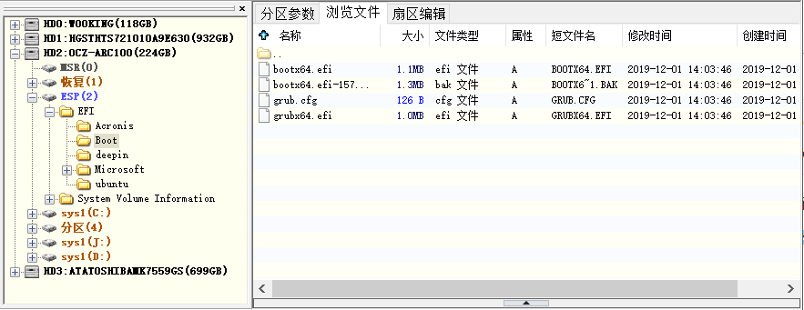

当使用UEFI固件时，CPU通电后，UEFI的工作内容主要包括：  

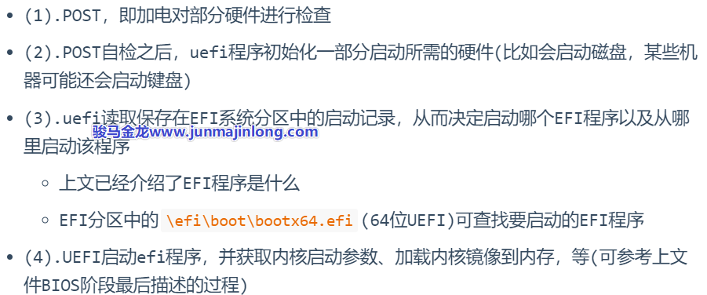

至此，内核已经加载到内存中，并进入到了内核启动阶段，CPU控制权将转移到内核，内核开始工作。

## 内核启动阶段

到目前为止，**内核已经被加载到内存掌握了控制权，且收到了boot loader最后传递的内核启动参数，包括init ramdisk镜像的路径**

但注意，所有的内核镜像都是以bzImage方式压缩过的，压缩后CentOS 6的内核大小大约为4M，CentOS 7的内核大小大约为5M，CentOS 8的内核大小约9M。所以内核要能正常运作下去，它需要进行解压释放。

```shell
# CentOS 8内核大小
$ ls -lh /boot/vmlinuz-4.18.0-193.el8.x86_64 
-rwxr-xr-x. 1 root root 8.6M May  8 19:07 /boot/vmlinuz-4.18.0-193.el8.x86_64
```

> 注：谁解压内核？
>
> 内核引导协议要求bootloader最后将内核镜像读取到内存中，内核镜像是以bzImage格式被压缩。bootloader读取内核镜像到内存后，会调用内核镜像中的startup_32()函数对内核解压，也就是说，内核是自解压的。解压之后，内核被释放，开始调用另一个startup_32()函数(同名)，startup32函数初始化内核启动环境，然后跳转到start_kernel()函数，内核就开始真正启动了，PID=0的0号进程也开始了......

当内核真正开始运行后，将从/boot分区找到initial ram disk image(后面简称init ramdisk)并解压。init ramdisk要么是initrd，要么是initramfs，它们可使用`dracut`工具生成，早期系统用initrd比较多，因为现在就会都用initramfs，所以后面可能会以initramfs来描述init ramdisk。

init ramdisk解压之后就得到了内核空间的根文件系统(这是启动过程中的早期根分区，也称为虚根)。对于使用systemd的系统来说，得到虚根之后就可以调用集成在initramfs中的systemd程序，其PID=1。从现在开始，就进入了早期的用户空间(early userspace)，systemd进程可以在此时做一些内核启动剩余的必要操作。

完成内核启动的必要操作后，systemd最后会将虚根切换为真实的根分区(即系统启动后用户看到的根分区)，并进入真正的用户空间阶段。systemd从此开始就成为了用户空间的总管进程，也是所有用户空间进程的祖先进程。

### 详细分析内核启动阶段

上面描述的内核启动过程很简单，但里面还有一些『细节』值得思考。

#### 1.如何找到init ramdisk

实际上，内核运行后，会创建一个负责内核运行环境初始化的进程，该进程会根据boot loader传递过来的内核启动参数找到init ramdisk的路径。正常情况下，该路径在boot分区中。之所以能够读取Boot分区是因为在固件阶段，bootloader程序已经加载了boot分区的文件系统驱动。

#### 2.为什么要用init ramdisk

因为直到现在还无法读取根分区，甚至目前还没有根分区的存在，但显然，之后是要挂载根分区的。但是要挂载根分区进而访问根分区，要求知道根分区的类型(比如是xfs还是ext4)，从而装在根文件系统的驱动模块。

由于不同用户在安装操作系统时，可能会选择不同的文件系统作为根文件系统的类型，所以不同用户的操作系统在内核启动过程中，根文件系统类型是不同的。如何知道该用户所装的操作系统的根文件系统是哪种类型的？

事实上，在安装操作系统的最后阶段，会自动收集当前所装操作系统的信息，并根据这些信息动态生成一些文件，包括用户所选择的根文件系统的类型以及对应的文件系统驱动模块。这个过程收集的内容会保存在init ramdisk镜像中。

如下图，是某次我安装CentOS 7过程中截取下来的生成initramfs镜像文件的图片。

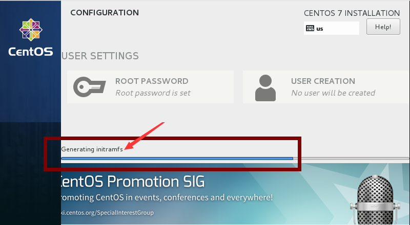

#### 3.内核中根分区的来源

内核会将init ramdisk镜像解压在一个位置下，这个位置称为rootfs，即根文件系统，这个根分区称为虚根，因为这个根分区和系统启动后用户看到的根分区不是同一个根分区。

对于使用initramfs镜像的ramdisk来说，**这个rootfs即为ramfs(ram file system)，它是一个在解压initramfs镜像后就存在且挂载的文件系统**，但是系统启动之后用户并不能找到它，因为在内核启动完成后它就会被切换到真实的根文件系统。

用户也可以手动解压/boot/initramdisk-xxx.img镜像：

```shell
$ mkdir /tmp/hhh
$ cd /tmp/hhh
$ /usr/lib/dracut/skipcpio /boot/initramfs-$(uname -r).img | zcat | cpio -idmv
```

可以想象一下，init ramdisk镜像解压在/tmp/hhh目录下，那么这个目录就可以看作是在内核启动过程中的rootfs。解压得到的根目录和系统启动后的根目录内核很相似:

```shell
$ cd /tmp/hhh
$ ls
bin   lib    run       sysroot
dev   lib64  sbin      tmp
etc   proc   shutdown  usr
init  root   sys       var
```

再深入一点看，会发现ramdisk中已经生成了我当前操作系统根分区和boot分区的驱动模块。

```shell
# boot分区是ext4，根分区是xfs
$ df -T
Filesystem          Type   ... Mounted on
...
/dev/mapper/cl-root xfs    ... /
/dev/nvme0n1p1      ext4   ... /boot

# initramfs中已经具备了ext4和xfs的驱动模块
$ cd /tmp/hhh
$ tree usr/lib/modules/4.18.0-193.el8.x86_64/kernel/fs/
usr/lib/modules/4.18.0-193.el8.x86_64/kernel/fs/
├── ext4
│   └── ext4.ko.xz
├── jbd2
│   └── jbd2.ko.xz
├── mbcache.ko.xz
└── xfs
    └── xfs.ko.xz
```

#### 4.PID=1进程的来源

或者说，PID=1的init程序集成在init ramdisk中？在内核启动过程中就加载了它？

对于早期的initrd来说，init程序并没有集成在initrd中，所以那时的内核会在装载完根分区驱动模块后去根分区寻找/sbin/init程序并调用它。且对于使用initrd的启动过程来说，加载/sbin/init的时机比较晚，很多内核启动过程中的环境都是由内核进程而非init进程完成的。

对于initramfs，它已经将init程序集成在init ramdisk镜像文件中了。如下：

```shell
$ cd /tmp/hhh
$ ls -l
total 8
lrwxrwxrwx. ... bin -> usr/bin
drwxr-xr-x. ... dev
drwxr-xr-x. ... etc
lrwxrwxrwx. ... init -> usr/lib/systemd/systemd
lrwxrwxrwx. ... lib -> usr/lib
lrwxrwxrwx. ... lib64 -> usr/lib64
drwxr-xr-x. ... proc
drwxr-xr-x. ... root
drwxr-xr-x. ... run
lrwxrwxrwx. ... sbin -> usr/sbin
-rwxr-xr-x. ... shutdown
drwxr-xr-x. ... sys
drwxr-xr-x. ... sysroot
drwxr-xr-x. ... tmp
drwxr-xr-x. ... usr
drwxr-xr-x. ... var
```


仔细观察上面的文件结构。init是一个指向systmed的软链接(因为这里使用的是systemd而不是SysV)，此外还有几个重要的目录proc、sys、dev、sysroot。

由于内核加载到这里已经初始化一些运行环境了，有些环境是可以保留下来的，这样系统启动后就能直接使用这些已经初始化的环境而无需再次初始化。比如**内核的运行状态等参数保存在虚根的/proc和/sys**(当然，内核运行环境是保存在内存中的，这两个目录只是内核暴露给用户的路径)，再比如，**已经收集到的硬件设备信息以及设备的运行环境也要保存下来，保存的位置是/dev**。

sysroot则是最重要的，它就是系统启动后用户看到的真正的根分区。没错，真正的根分区只是ramdisk中的一个目录。

### systemd在内核启动阶段做的事

在内核启动阶段，当调用了集成在initramfs中的systemd之后，systemd将接管后续的启动操作。但是在这个阶段，systemd具体会做哪些操作呢？

分析systemd在启动阶段所做的事之前，最好对启动流程中的systemd能有一个全局的了解。

注：下图适用于即将解释的内核启动阶段中systemd的流程，也适用于内核启动完成后systemd的流程。

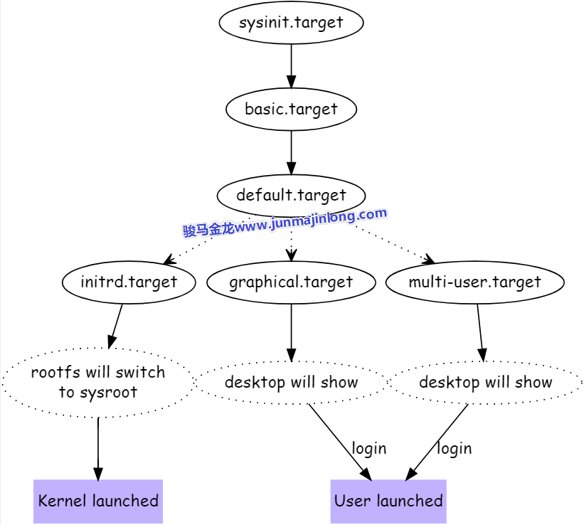

在启动过程中，systemd有几个大目标，每个目标以`.target`表示。systemd的target主要作用是对多个任务进行分组，比如basic.target中，可能包含了很多任务。

- **第一个大目标：sysinit.target**  
  sysinit.target主要目的是读系统运行环境做初始化，初始化完成后进入下一个大目标  
- **第二个大目标：basic.target**  
  basic.target的作用主要是在环境初始化完成后执行一些基本任务，算是做一些早期的开机自启动任务，basic.target完成后进入第三个大目标  
- **第三个大目标：『default.target运行级别』**  
  default.target是一个软链接，链接到不同的target表示进入不同的『运行级别』，运行级别阶段的目的是为最终的登录做准备：  
  - 如果是内核启动过程中(内核启动时调用了集成在initramfs中的systemd就处于这个过程)，那么大目标是initrd.target，该target的目标是为后续虚根切换到实根做初始化准备，比如检查并挂载根文件系统，最终虚根切换实根，并进入真正的用户空间，也即完成了内核启动或内核已经成功登录  
  - 如果不是内核启动过程中，可能会选择不同的『运行级别』，通常是图形终端的graphical.target，或者多用户的运行级别multi-user.target，它们的目标都是完成系统启动，并准备让用户登录系统  

所以，在内核启动阶段，要分析systemd的工作流程，沿着`sysinit-->basic-->initrd-->kernel launched`这条路线即可。

回到在内核启动阶段，systemd接管后续的启动操作，具体会做哪些事呢？在`man bootup`手册中给出了内核启动阶段中systemd的工作流程图。

如下图。

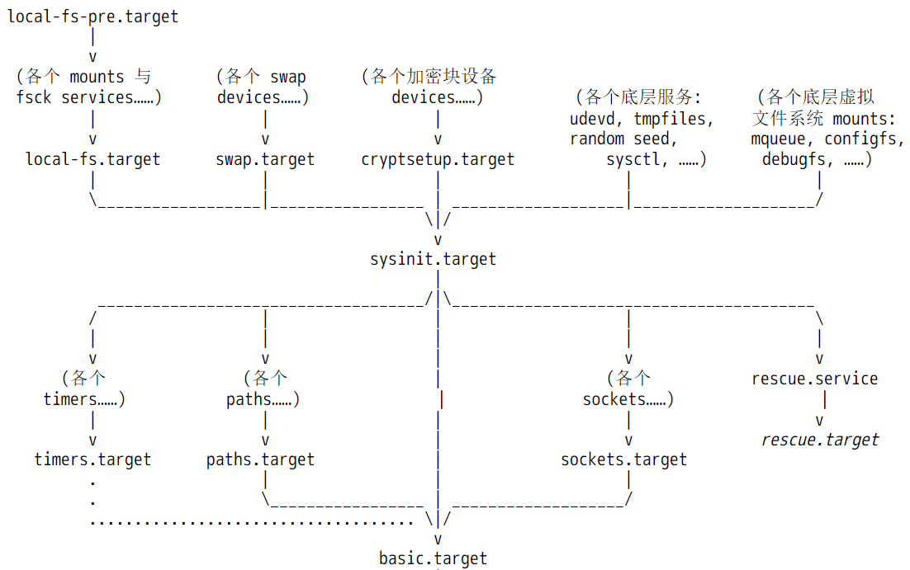

注意，图中所有涉及到的unit文件均来自initramfs镜像解压后的目录，也即虚根，而不是来自真实的根文件系统，因为现在还没有真实的根文件系统。例如`<ramfs>/usr/lib/systemd/system/sysinit.target`文件。

对于已经启动完成的正常系统来说，sysinit.target是用于做系统初始化的，basic.target则是系统初始化完成后执行的一些基本任务，比如启动所有定时器任务，开始监控指定文件等，算是系统启动过程中早期的开机自启动任务。

但是在内核启动阶段，sysinit.target和basic.target所代表的含义，显然与启动完成后这两个文件代表的含义有所不同。在内核启动阶段，sysinit.target中的`sys`指的是内核阶段的虚拟系统，basic则代表ramdisk决定要执行的基础任务。

换句话说，在内核启动阶段，**systemd也将initramfs所启动的环境看作是一个操作系统**，只不过是一个虚拟的操作系统。

当basic.target完成后，进入initrd.target，之所以是initrd.target，是因为initramfs中的default.target软链接指向的是initrd.target。

```shell
$ cd /tmp/hhh/usr/lib/systemd/system
$ ls -l default.target
...... default.target -> initrd.target
```

下图描述了initrd.target阶段的工作流程。

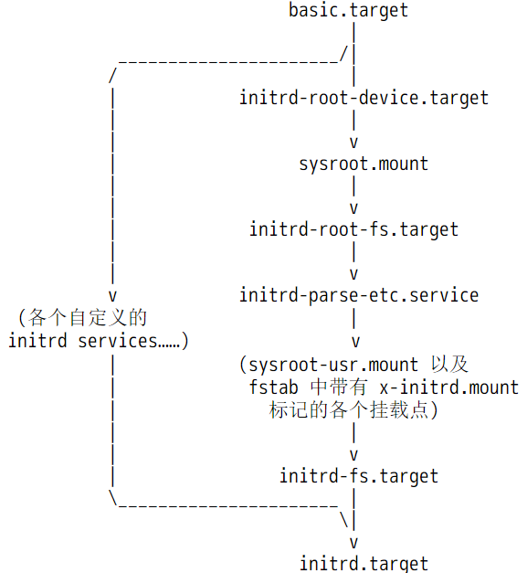

在initrd阶段，systemd为后续切换到真实的根文件系统做准备，比如检查根文件系统并将其挂载在`<ramfs>/sysroot`下，再比如从/etc/fstab中找出部分需要在这个阶段挂载的分区。如果一切没问题，将进入最后的阶段：从initramfs的虚根`<ramfs>/`切换到实根`<ramfs>/sysroot`。

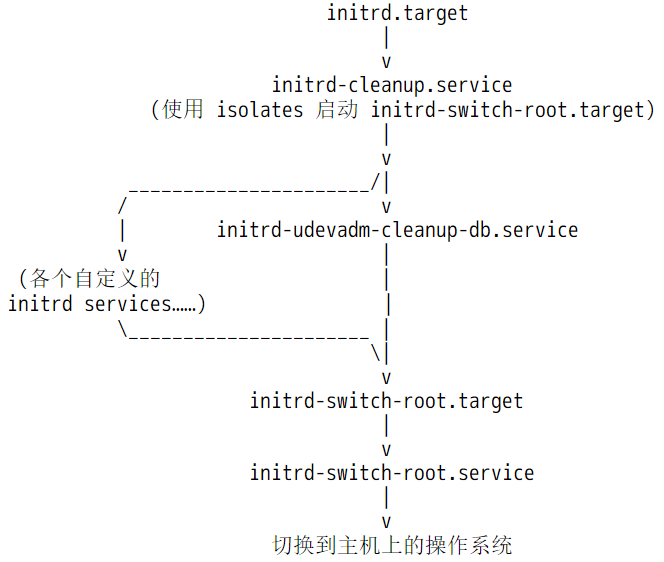

从此开始，`<ramfs>/sysroot`将代表真实的根文件系统，systemd也将从这个根文件系统调用init程序(systemd)替换当前的systemd进程(所以PID仍然为1)。从此内核引导阶段退出舞台，开始进入真正的用户空间，systemd进程也将在这个用户空间开始下一阶段的流程：`sysinit->basic->default->login`。

所以，总结一下内核启动阶段中systemd接管控制权后到用户登录中间的流程。如下图。虽然图中内核启动之后的阶段还未展开介绍，但我想大家应该能理解，即使不理解也没关系，稍后会展开。

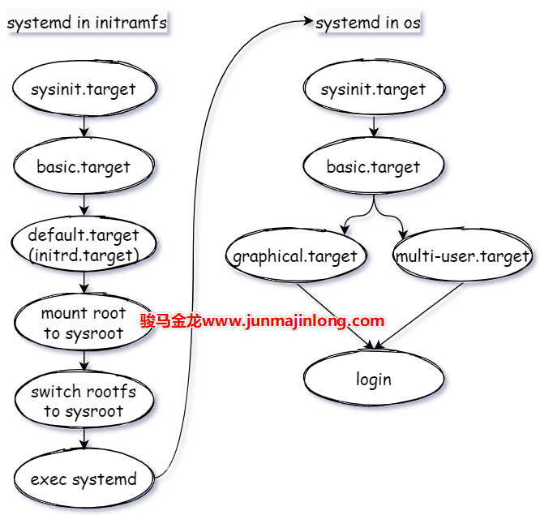

## 内核启动后，用户登录前

当systemd(这个是来自真实根文件系统的systemd进程)进入到用户空间后，systemd将执行下一轮工作流程，全局路线为：`sysinit.target->basic.target->default.target->...->login`。

其中default.target是一个软链接，一般指向graphical.target(图形界面)或multi-user.target(多用户模式)，对应于SysV系统中的『运行级别』阶段。

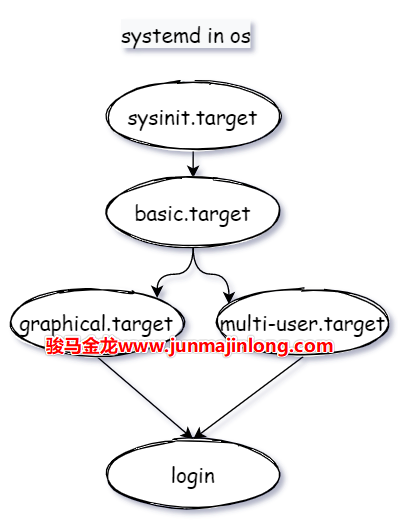

需注意，在这里涉及到的所有unit文件都来自于真实的根文件系统，例如`/usr/lib/systemd/system/sysinit.target`。而内核启动阶段systemd工作路线中涉及到的unit文件都来自于initramfs构建的虚根，例如`<ramfs>/usr/lib/systemd/system/sysinit.target`，而且前文也提到过，在systemd眼中，initramfs构建的也是一个系统，只不过是虚拟系统，最终systemd会从这个虚拟系统中切换到真实的系统中，切换的内容主要包括两项：切换根分区，切换systemd进程自身。

在流程的每一个大阶段，和前面介绍的initramfs中的systemd是类似的。

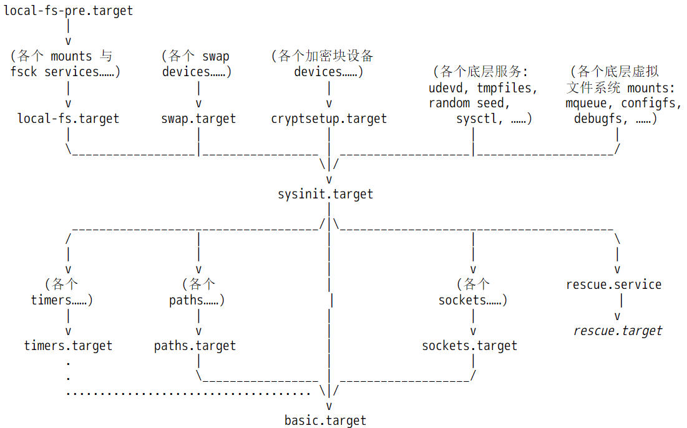

basic.target完成后，将通过default.target决定进入哪一个『运行级别』。如果是进入graphical.target，那么会启动和图形终端相关的服务任务，如果是进入multi-user.target，那么：

```shell
$ cd /usr/lib/systemd/system/
$ ls -1 multi-user.target.wants
dbus.service
getty.target
systemd-ask-password-wall.path
systemd-logind.service
systemd-update-utmp-runlevel.service
systemd-user-sessions.service
```

其中几项需要注意： 
- getty.target：启动虚拟终端实例(或容器终端实例)并初始化它们  
- systemd-logind：负责管理用户登录操作  
- systemd-user-sessions：控制系统是否允许登录  
- systemd-update-utmp-runlevel：切换运行级别时在utmp和wtmp中记录切换信息  
- systemd-ask-password-wall：负责查询用户密码  

除了这几个multi-user.target所依赖的服务外，在/etc/systemd/system/multi-user.target.wants下也有需要启动的服务，这里的服务是用户定义的systemd类的开机自启动服务。

```shell
$ cd /etc/systemd/system
$ ls multi-user.target.wants
atd.service             mcelog.service
auditd.service          mdmonitor.service
chronyd.service         NetworkManager.service
crond.service           remote-fs.target
dnf-makecache.timer     smartd.service
firewalld.service       sshd.service
irqbalance.service      sssd.service
kdump.service           tuned.service
libstoragemgmt.service  vdo.service
```

不仅如此，为了兼容早期sysV的rc.local开机自启动功能，systemd会检查/etc/rc.local是否具有可执行权限，如果具备，systemd会在此阶段自动执行rc.local中的命令。

## 参考资料

- <https://wiki.archlinux.org/index.php/Arch_boot_process>  
- <https://web.archive.org/web/20150430223035/>
- <http://archlinux.me/brain0/2010/02/13/early-userspace-in-arch-linux/>  
- <https://developer.ibm.com/articles/l-linuxboot/>  
- man bootup、man systemd.special  